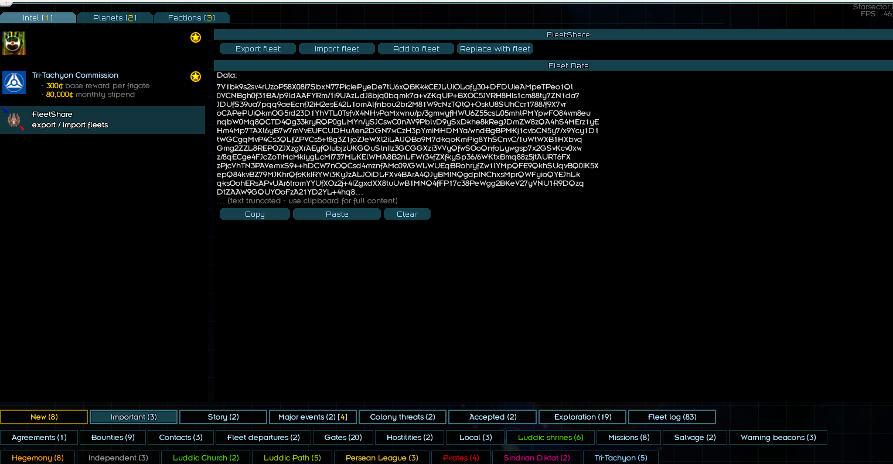

# Starsector Fleet Sharing Mod

## Description

This mod enables seamless fleet sharing between players in *Starsector*. Export your fleet into a shareable string, allowing another player to spawn it in their game. The shared fleet retains all details, including:

- Fleet composition
- Weapons
- Fighters
- Captains
- Cargo contents

Challenge friends to test their "overpowered low-tech fleet" against your high-tech masterpiece, even with modded weapons, hulls, and captain skills.

## Prerequisites

To use this mod, you need:

- **Console Commands** by LazyWizard: [Download here](https://fractalsoftworks.com/forum/index.php?topic=4106.0)
- **LazyLib** by LazyWizard: [Download here](https://fractalsoftworks.com/forum/index.php?topic=5444.0)

## How to Use

## Using the UI
This menu is accessible via the intel tab of the starsector campaign in the important category

Use the export button to get a string representing your fleet to share with others, or import someone else fleet from your clipboard!

## Using console commands
### Sharing Your Fleet
1. In-game, open the console with <kbd>Ctrl</kbd> + <kbd>Backspace</kbd>.
2. Type the `exportfleet` command.
3. The shareable string is automatically copied to your clipboard.


### Importing a Fleet
1. In-game, open the console with <kbd>Ctrl</kbd> + <kbd>Backspace</kbd>.
2. Enter the command `importfleet SharedStringHere`, replacing `SharedStringHere` with the shared string.
3. The fleet will spawn in your game.


### Adding to your Fleet
1. In-game, open the console with <kbd>Ctrl</kbd> + <kbd>Backspace</kbd>.
2. Enter the command `addtomyfleet SharedStringHere`, replacing `SharedStringHere` with the shared string.
3. The fleet will be added to yours.

### Replacing your fleet
1. In-game, open the console with <kbd>Ctrl</kbd> + <kbd>Backspace</kbd>.
2. Enter the command `replacemyfleet SharedStringHere`, replacing `SharedStringHere` with the shared string.
3. Your fleet will be replaced with the one from the string.

### FAQ
- **Can this mod be added or removed mid-game?**  
  No, it cannot be removed once added.
- **What about mod compatibility?**  
  The mod is compatible with all mods, but you must have the same mods installed as the player who shared the fleet.

<details>
<summary>My fleet (vanilla)</summary>

```
7V1bk9s2sv4rUzoP58X08i7SbxN77PiciePyeDe7tU6xQBKkkCEJLUiOLafy30+DFDUieAMpeTPeo1Ql0VCNBgh0f31BA/p9ldAAFYRm/1i9UAzLdJ8bjq0bqmk7a+vZKqUP+BXOC5JVRH8HIs1cm88ty7ZN1da7JDUfS39ua7pqq9aeEcnfJ2iH2esE42L1omAlfnbou2br2M81W9cNzTQtQ+OskU8SUhCcr1788/f9X7vroCAPePUiQkmOG5rd23D1YhVTL0TsfvX4NHvPaMxwnu/p/3gmwyfHWU6Z55csL05mhlPMYpwFO84vm8eunqbW0Mq8QCTD4Qg33kryRQP0gLMYn/ySJCswC0nAV9PblvD9ySxDkhe8kRegJDmZW8zQA4hS4MErz1yEHm4Mp7TAXl6yB7w7mVvEUFCUDHu/len2DGN7wCzH3pYmiMHDMYa/wndBgBPMKj1cvbCN5y7/x9Ycy1D1tWGCgqMvP4Cs3QLfZPVCs5+t8g3Z1joZJeWXl2iLAlJQBo9M7dkqoKmPig8YhSCnvC/1uWtWXB1HXbvqGmg2ZZL8REPOZJXzgXrAEyfQIubjzUKGQuSlnIIz3GCGGXzi3VVyQfwSOoQnfoLywgsp7x2GSvKcv0xwz/8qECge4FJcZoTrMcMkiygLcMi737MLKElWMA8B2nLFWr34fZXfkySp36/6WKtxBmq88z5jtAURT6FXzPjcVhTN3PAVemxS9++hDCW7nOQCsd4mznfAMc09/GWLWUEqBRohryfZw1lYMpQFE9QkhSUqvBQ0IK5XepQ84kvBZ79MJKhrQfsKkIRYWi3KyJzALJOiDLFXv4BArA4QJyBMINQgdpINChxsMprQWFyioQYEJhLkqksOohERsAPvUAr6tromYYUfXOz2j+4IZgxdXX8tuUwB1MNQ4fFP17c38PeWgg2BKeV27yVNU1R9DQzqDtZAAW9GQUYOoFzA21YD2YL+4hq8thsS5H/ZUlYwRIrHT6b6fFvpDEjBPZAed1EzrtfIA5uurrgdviYvKcMHSIEnP9Fi4wPI4vAAKLWYv2G03Ct6ntCi0tZf7q7UilP1QeOqU+y2fJS3b9/9780rrr6gmzBn+NEStVprxr61ph+1vr79ePPh3fXHt+/etFgckK89AqcZgdswU8eHMsDHbvismw9688FY8G6q2bS2lsxMMwjNaj4049PMJfxklgcoslqQ397dXX3AIahZVOzR8W844+wslWtBUeDwF4BTzv/X5sGbMqslBFC2ErUNRg87FHD5hbFUj/Yrxsc3ReW2qAoUgKJVwtwms1tkKclgWL2UMKXHlLUbQDMfo7TDdC01QlO6a6tFiRjoGK4cyjZDS5ph+603iG0pzbY07BAa8i+ty5O2uSZsG/YPsz1DG5J0OKktiihB9x0m2iQTTXY2dJl1BfzgqkDy1wmK77ilabCwchbAAfiCg73Tkf945L60PRDRQ/mVdy16SVqflyR4RSEGdxqBgnkHNwZsJmithK8y7nhoszwJbZ4n8R9m7u+CDYoi1Db4P8JcMfJl2NjTKCLBsZU3TrTyhtW28rcElwXOUFaIZl7TLMc+m51fYsQOFvnRFh6Z1IPfIGe1eyzUT+CJ58UGl4267W2U0bFRK59RFOafKQu9z3VkMf1k2LCNILNgtsYoTSkjI20TBPweozSkKdvISlgT0M8DTAjaang4QsteONTNaTjcEB63VnmZCs+qyJtjIv5XSbYprjRhEDP7Ise8qMLir5XDA/EOTvmy829Q+MCBUHh+Mu4KYRNIXMa72Ud8fyJIT4R7/2GQ/h4zssFJ/Z7HqF7FdQdEf30jF8BZJ0K7l2IWAJSznarLh3L62SDeWQbxCxotMibrJY3sRaHgqLmaa6VuSAZiQLL/zq9e4bSStVFbNWx2KvDtx+l2SLUlSdl12l0ZLBfiqcGwqx0hDfj/XRNX5Bjf9xBaUux0KSpDikqbsFmgKjHGMkar14dXnzt1ptM2dWOta4ZgxcSMJM9XkgR7XJQSyhFSxsx87wjcxt1j0L1+949pxNVORdyY53JJ4AHNLg8gKJfE3TVywyBCuuLbrq+YBlYVZASGogWOEZmqig3DPyMuP5NCwAEw0/uga16OTZtIgA30vMg2HNJwi4zEAbmPMouL44uP4LfmzfovxOwNCCqEiA+TmE1YpfqNSzeK3MOUdjemyDAOkzMh+FjXbQhPSLwpUDyRj2Ig+WfC+QFWmsCq2ckdywsNUU3mhVCcSFkMfb3AYswIaS6W48lajii0dV03AkWPDEsxVStQXNNyFdXClm6rIPuOdrEc/37LsdROvASTgGnR7CEvsRBjIC349RsAwt6EvCuXkF9uH4ZZWl2WKWgJ6u4GtAEbFYyClk6A/xCVXGJKP0v6Sh7X1QW4Xi1qlXip8lZJBfK8NxThYkfBc2AkxHwGQHIK5CccJH/DQZ27QuUXkhDEdsWGlbwSocmFVtUMPIPFofWB4zwBIyBhGTjEgC0BbOsvbRCQ28d54dHIKzbY8/ebWmc0DMHOxyzDfDiojHl2ry8xJTQC3OXzWMBLZ9xO1jnBkQZTJRcC+XjCTiCuc2oMbxFhYiJQfFkEa40ZGBUA9HHSzzSJQPDuwRkIYHImdna2lGSFF+IIZ1PvNl7DIWQuM/Qwb/NH1oGQqbERxjKechX4AyRADzuPpFvwZosJ6kpFubO1nZjnejFQ4oHLzzXrlEyuKHP1TpLH3Y+s3rCQoAYnBMU4nVaAcstdGy+kAXiR2cRYAoY/Sw6EQxEIf9yfUBaIOSwCcQ7QJpWshhAD3rHcJiS7n0CpMrnnI85y/prjfEOUwpxV2MFoMoFn4BeklVNeV8KNEk8l48U1QckDirszLKb4a4+ZgNRxWZ5ekqO9kzPl9nEC5ojRDED6M2IRYhPyk2GQ+MSbXja+BiBlXH69LaMBBlXBEyNP0T2uCldaG0IjDTY4SXNQlBlhzWCUIoweDAUvhgbxAP64fMBTFmBiA6YTBv0P3Yg1aICDeeMdzCxB0/RTwyLA97jEqiYZDakWuK7GGinY5dGQhk3F8S1V8R1kh0h33Ug/XzTU7DRL13UdKmP3vv7Hj3dXH9E9Yqjt7c9w9lFaFYlM5jyG6QxJum5+uy4hb7ZkEfO5Z9QpYpF0Mnv93yVpDWE7Fwdp9d/qfzDIEPMK97z09y7amMt7SYF8FykQy1pHrhE6ih1iVzHtQFVcx9EVMzAjF/mqpQXW2ZTeWJy66E9/TGcEXqPi6pZmyqvyHgvFk9oMpBgOuNtIkYPFTb/ZLhgF8ykV+S7Q/IA8gOiE3FeAOIqLSuhBBBRTb0OTsNb0KuLDAAIxZ3rR6qer1aptqj7WI8UOLNBlYx0pzlpfK9hHvrkObcfBaLFWH+XbNhCukYDOtMCjQu6XETyg3yzDcyzoPC4j1RkwntnZoOqkwEXOvx85x5bqR2EYKQgjXzFVU1WQ62sKslxDtxw3MKzoDHJ+i6/ewFDCtpwbJ8n5doNwIVeId6KY19kuLwZdrSThIuDfj4AHAdZd+FfBjo8gJnOR4mq2ryBdtyIVG3gdnQPIX6GsPCeIB4zEMpKtnSjaHVHuB/WLgD9ZATd9DFBt6soa2yDgDsi2Y2qmYlmmGpqA6Gu0vKiyXUHyQ1LinkNU7kmSHrJ6A3BK0o0lkt6E3GIltFivxjvzGUb3uOe4bYpi9PWC809bDSzdBLc3ChU3CCEMj/Ba8TXkKuvA19TQRarjGmcLwyc29AeLB541R8DGqrlmxvXLaoIXVUcvqlk+Ojh6pjJknrjUVPjn6pbvmewwYsKRGesbVCHnKEG16PUcxRMqFnLk06KPrF2wMNJ3u1xB/tzNQLGXUNbQX12miUmWflZLD+YMdKrJEElVtKlSrKbKI1DJaJUSn7RIpjF9vOewowYMNz7hQFbGcfVntSGNwxpquABPlMQd2SeS5XxHpfHaVn3HgHjPdeAy14TNOu0zsfUsUI9uRgq0IxtZT/fOiO/d/F8nEFZfvaylbtQRQJUdrXvhjRpRHb7/geHgPuFKIukKIKL7gvXfS273bKitOS3rXtuiJcb98a6CCcvaa+70xtzpy6sMD1c2HDyGnvOl+pKqwCWFiFpTdqnLlBJ2Ws86ENuZzUPfh9swDhdITNwbIe523mFeU3D1X/prw3n5Q73KCy+CCPEDKAban7ZsGRe3Wz3oofC3sgL2Hvq2mR+6SUF3pMgEp2FkmHL8dFeKTOspmRx9acEJ6jvdpZtyXRtyEyNHJtzvIHF7w2CHcmSCWzO8YLoqMWXa9OinfB/wQxJUgk/tpfea4AKNuSeCK/NNMlVdn6e7t3+Jz59sfB5ooRoahqY4PENlunqg+I6KlFAzAyvUfAet2xb8lPj8rCdeX9I8pbUfPCfpJRweSjuHh4RAaojKkKLSpKjMCf0PQGLzvLqA4t9bHd5XpjORozuqCr9Uy3w3MIBVHWHTRApP4CimGRkKAulVglC3NUCBtY+Wb8ecqUSuJ4X1jW4FaAPNm884E8/Tz6nFy1n3JI3ZzUtN5IYCtqNyVX2gcvx6VBCBHpflhMo+4baVodI+ER963IFeP6Qva3POfYQLEn0XSOTba2Nt+rqiu7qlmEbkAhL5WLGxZfq2ZkZ6cD6HZEnwq06E+ANgteTmyuOjleIdVwuqit+RcEPjWICyOVeDDNT3CecHB6iWHAUfzNjLZZ6FzPngwUYhjhvO/0+hYlTWmjm5a7qkiHnIS8NfvObsEEn6LiLuZqEFp+2km4ovSPknHfJGqrFGrqlgzQafzQ98BVmGqWghRHFqGKnIOSdSygVqstfndi/C7U9JzkzRHm1mnnavx9yNz7/jjDK+xMKpjTkJzP0pZC/nO3fdqy+EC23r+0c7VK4UVe/NrhOIPXLJSM8lg/2ns3vPcaOy72R4zy2qQ4fIBZgHbU7RBMYPvLKQSBy2GL2XwXa4TSX2vpI4LlmNmWM+tNQtr0uq40OckzjjyL1lNCU57jMfQ152c28h3TZngweuOLwYkSdrRNZ6EGBLXyumGzmKGZmR4iArUELfsPQwwqbunO8a93nO63lc6EOOYd6NG+8pvRegvOfC188o305d4yp3r3ffhdNS90irM+7eVmVwcvLKuqz0iVQqUp0UCNnDT4doZtl5yNMyvfWE9FWUDExSMycX1HuqqKdZmon6j/81p3UO1zSLkt4LfRfxv4j/dyb+64v4X8T//6/4u3+6+C/LpEhlnxfrSsRQ7IM0TijL+EFvqSh0XHtWGW2uZeIvcokgn7g29d9DvNcmHiXJ6VH1+GN9gRLv6+dM/OlOYPfjzmcoJ8kVv4Tm6q66sYNHaqj6NcgmtNlVIyX8L9dweJ1Jdeq/Epp/lfx4d7GDWVurdSY+peHjT15utwmpMyG1nn24ufv5rx9e3txVSnDU2lwbYuuoxMl0S91wbbElv+9Kpk9VbJgitj8jONHWcUyxbV0WmKJgQ7L68rOpkVuayIMhhr0UFyiRGIPeGf4D5RXcidSE653OKYtRVqefJue803VEq62lqYadTuufA/FCVCBPm2bQI2KP7fXp9tZYe2O6fUdIj9ubEhMw1t4aal/jdy3auyChVXHg0Voemv1yc/3+53edRq26yxntNihN+S8kBvfz2qW/0SQjMzs7JFFmtMmBttplm9HmqFa1ta7jrfbVpjNaPGaZ5jQ63hmY0S7fMByGc1vVR5se61ZacirxdpWTP2PqH8qk/g3fozb2VKMqnAhhncXeTKmWYitVrlWz5zKnJb/Mb0OSjp7JDRTF81agfS5tRsNHl3Oq0eP3j+/+7q+3t53xsz6e0/By/Psic7T+cIXSVKPW9/kWBwQlrwBqgez3T+DGFJ9WLz7xzZYsRCz8tHr2qcpaV09f0y8Fo0X1kITVo6h59McjUt+9v3n59vp2deBfDRECnnRD+e+DZMEGxKEzmNHWlPkEfAAvKnP+q9wJSrddOzLKIaCMlVteyp6hjEZg2vHMMYCjy38ZHg8ymBrCljBUYI9feotm9377frhhex2LTcn92+ZH4Ua5NjeQ+uJ09oj345euaLNjMIuH02BzDb4P3t3Stq1jaN3Gv/7xfw==
```
</details>


## License

This software is free and unencumbered, released with the following conditions:

Anyone may copy, modify, publish, use, or distribute this software, in source code or compiled binary form, for any purpose, including commercial use, subject to these restrictions:

- You may not sell this software as-is.
- You may not misrepresent the origin of this software or claim authorship or exclusive rights to the original work.
- Attribution is appreciated but not required.

To the extent permitted by law, the author(s) dedicate all copyright interest in the software to the public domain, subject to the above restrictions.

**Disclaimer**: The software is provided "as is," without any warranty, express or implied, including but not limited to merchantability, fitness for a particular purpose, or non-infringement. The authors are not liable for any claims, damages, or liabilities arising from the use of or dealings with the software.


## Credits

**Author**: MatlabMaster

This mod was made possible thanks to community resources, including the *Starsector* wiki, open-source mods, and the official Starfarer API.
