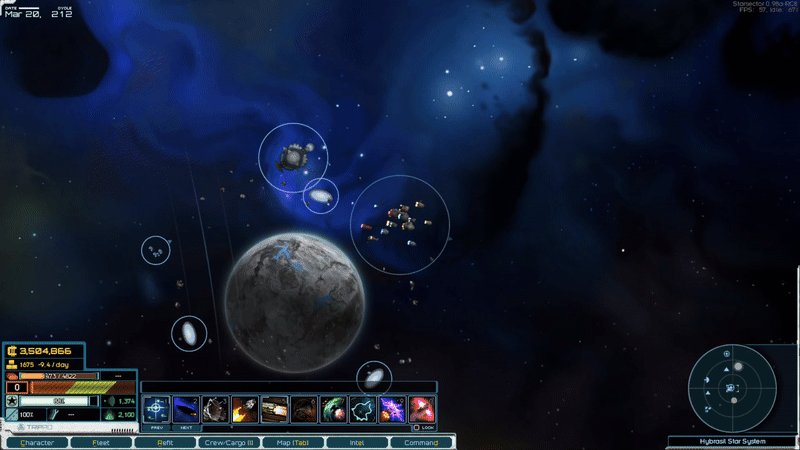
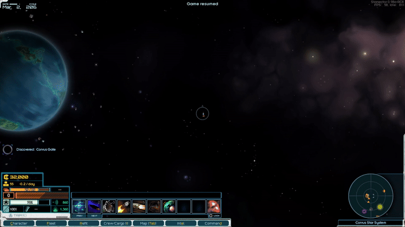

# Starsector Fleet Sharing Mod

## Description

This mod enables seamless fleet sharing between players in *Starsector*. Export your fleet into a shareable string, allowing another player to spawn it in their game. The shared fleet retains all details, including:

- Fleet composition
- Weapons
- Fighters
- Captains
- Cargo contents

Challenge friends to test their "overpowered low-tech fleet" against your high-tech masterpiece, even with modded weapons, hulls, and captain skills.

## Prerequisites

To use this mod, you need:

- **Console Commands** by LazyWizard: [Download here](https://fractalsoftworks.com/forum/index.php?topic=4106.0)
- **LazyLib** by LazyWizard: [Download here](https://fractalsoftworks.com/forum/index.php?topic=5444.0)

## How to Use

### Sharing Your Fleet
1. In-game, open the console with <kbd>Ctrl</kbd> + <kbd>Backspace</kbd>.
2. Type the `exportfleet` command.
3. The shareable string is automatically copied to your clipboard.

### Importing a Fleet
1. In-game, open the console with <kbd>Ctrl</kbd> + <kbd>Backspace</kbd>.
2. Enter the command `importfleet SharedStringHere`, replacing `SharedStringHere` with the shared string.
3. The fleet will spawn in your game.

### FAQ
- **Can this mod be added or removed mid-game?**  
  Yes, it can be safely added or removed during a campaign.
- **What about mod compatibility?**  
  The mod is compatible with all mods, but you must have the same mods installed as the player who shared the fleet.

My fleet (vanilla)

eyJsb2NhdGlvblkiOi0zMDc2LjYwNDczNjMyODEyNSwibW92ZURlc3RpbmF0aW9uWCI6LTc3Ni41NDkwMTEyMzA0Njg4LCJtb3ZlRGVzdGluYXRpb25ZIjotMzA3Ni41Mjc4MzIwMzEyNSwiaXNQbGF5ZXJGbGVldCI6dHJ1ZSwibG9jYXRpb25YIjotNzc2LjI0MjczNjgxNjQwNjIsImFiaWxpdGllcyI6W3siYWJpbGl0eUFjdGl2ZSI6ZmFsc2UsImFiaWxpdHlJZCI6ImdvX2RhcmsiLCJhYmlsaXR5SW5Qcm9ncmVzcyI6ZmFsc2V9LHsiYWJpbGl0eUFjdGl2ZSI6ZmFsc2UsImFiaWxpdHlJZCI6InNlbnNvcl9idXJzdCIsImFiaWxpdHlJblByb2dyZXNzIjpmYWxzZX0seyJhYmlsaXR5QWN0aXZlIjpmYWxzZSwiYWJpbGl0eUlkIjoiZW1lcmdlbmN5X2J1cm4iLCJhYmlsaXR5SW5Qcm9ncmVzcyI6ZmFsc2V9LHsiYWJpbGl0eUFjdGl2ZSI6dHJ1ZSwiYWJpbGl0eUlkIjoic3VzdGFpbmVkX2J1cm4iLCJhYmlsaXR5SW5Qcm9ncmVzcyI6dHJ1ZX0seyJhYmlsaXR5QWN0aXZlIjpmYWxzZSwiYWJpbGl0eUlkIjoic2NhdmVuZ2UiLCJhYmlsaXR5SW5Qcm9ncmVzcyI6ZmFsc2V9LHsiYWJpbGl0eUFjdGl2ZSI6ZmFsc2UsImFiaWxpdHlJZCI6ImludGVyZGljdGlvbl9wdWxzZSIsImFiaWxpdHlJblByb2dyZXNzIjpmYWxzZX0seyJhYmlsaXR5QWN0aXZlIjpmYWxzZSwiYWJpbGl0eUlkIjoiZGlzdHJlc3NfY2FsbCIsImFiaWxpdHlJblByb2dyZXNzIjpmYWxzZX0seyJhYmlsaXR5QWN0aXZlIjpmYWxzZSwiYWJpbGl0eUlkIjoiZ3Jhdml0aWNfc2NhbiIsImFiaWxpdHlJblByb2dyZXNzIjpmYWxzZX0seyJhYmlsaXR5QWN0aXZlIjpmYWxzZSwiYWJpbGl0eUlkIjoicmVtb3RlX3N1cnZleSIsImFiaWxpdHlJblByb2dyZXNzIjpmYWxzZX0seyJhYmlsaXR5QWN0aXZlIjpmYWxzZSwiYWJpbGl0eUlkIjoiZnJhY3R1cmVfanVtcCIsImFiaWxpdHlJblByb2dyZXNzIjpmYWxzZX0seyJhYmlsaXR5QWN0aXZlIjpmYWxzZSwiYWJpbGl0eUlkIjoicmV2ZXJzZV9wb2xhcml0eSIsImFiaWxpdHlJblByb2dyZXNzIjpmYWxzZX1dLCJhY2NlbGVyYXRpb24iOjMyMCwibWF4QnVybkxldmVsIjoxNiwic2hpcHMiOlt7ImZsdXhDYXBhY2l0b3JzIjo0MSwibmFtZSI6IklTUyBSZWRzaGlmdCIsImZsdXhWZW50cyI6NTAsImZpdHRlZFdpbmdzIjpbXSwiZml0dGVkR3VucyI6W3siZ3VuSWQiOiJoZWF2eWFjIiwic2xvdElkIjoiV1MgMDA4In0seyJndW5JZCI6ImhlYXZ5YWMiLCJzbG90SWQiOiJXUyAwMDkifSx7Imd1bklkIjoidGFjbGFzZXIiLCJzbG90SWQiOiJXUyAwMDYifSx7Imd1bklkIjoibWluaW5nbGFzZXIiLCJzbG90SWQiOiJXUyAwMTcifSx7Imd1bklkIjoiZ3Jhdml0b25iZWFtIiwic2xvdElkIjoiV1MgMDA3In0seyJndW5JZCI6ImhlYXZ5YWMiLCJzbG90SWQiOiJXUyAwMDQifSx7Imd1bklkIjoibWluaW5nbGFzZXIiLCJzbG90SWQiOiJXUyAwMTUifSx7Imd1bklkIjoiYXJiYWxlc3QiLCJzbG90SWQiOiJXUyAwMDUifSx7Imd1bklkIjoibWluaW5nbGFzZXIiLCJzbG90SWQiOiJXUyAwMTYifSx7Imd1bklkIjoiaGFycG9vbnBvZCIsInNsb3RJZCI6IldTIDAxMyJ9LHsiZ3VuSWQiOiJncmF2aXRvbmJlYW0iLCJzbG90SWQiOiJXUyAwMDIifSx7Imd1bklkIjoiZ3Jhdml0b25iZWFtIiwic2xvdElkIjoiV1MgMDAzIn0seyJndW5JZCI6ImxycGRsYXNlciIsInNsb3RJZCI6IldTIDAxNCJ9LHsiZ3VuSWQiOiJoaWwiLCJzbG90SWQiOiJXUyAwMDAifSx7Imd1bklkIjoiZmxhayIsInNsb3RJZCI6IldTIDAxMSJ9LHsiZ3VuSWQiOiJoaWwiLCJzbG90SWQiOiJXUyAwMDEifSx7Imd1bklkIjoiaGFycG9vbnBvZCIsInNsb3RJZCI6IldTIDAxMiJ9LHsiZ3VuSWQiOiJoZWF2eWFjIiwic2xvdElkIjoiV1MgMDEwIn1dLCJjb21iYXRSZWFkaW5lc3MiOjAuOTQ5OTk5OTg4MDc5MDcxLCJpc0ZsYWdTaGlwIjpmYWxzZSwiaHVsbE1vZHMiOlsic29sYXJfc2hpZWxkaW5nIiwiYW5kcmFkYV9tb2RzIiwiY29oZXJlciIsImZsdXhkaXN0cmlidXRvciIsImJsYXN0X2Rvb3JzIiwibWlzc2xlcmFja3MiLCJ0YXJnZXRpbmd1bml0IiwicmVpbmZvcmNlZGh1bGwiLCJmbHV4Y29pbCJdLCJjYXB0YWluIjp7InNraWxscyI6W3sic2tpbGxJZCI6ImVuZXJneV93ZWFwb25fbWFzdGVyeSIsInNraWxsTGV2ZWwiOjF9LHsic2tpbGxJZCI6InRhcmdldF9hbmFseXNpcyIsInNraWxsTGV2ZWwiOjJ9LHsic2tpbGxJZCI6InN5c3RlbXNfZXhwZXJ0aXNlIiwic2tpbGxMZXZlbCI6Mn0seyJza2lsbElkIjoiY29tYmF0X2VuZHVyYW5jZSIsInNraWxsTGV2ZWwiOjJ9LHsic2tpbGxJZCI6ImltcGFjdF9taXRpZ2F0aW9uIiwic2tpbGxMZXZlbCI6Mn0seyJza2lsbElkIjoiZmllbGRfbW9kdWxhdGlvbiIsInNraWxsTGV2ZWwiOjJ9LHsic2tpbGxJZCI6InBvbGFyaXplZF9hcm1vciIsInNraWxsTGV2ZWwiOjF9LHsic2tpbGxJZCI6ImFwdGl0dWRlX2NvbWJhdCIsInNraWxsTGV2ZWwiOjB9LHsic2tpbGxJZCI6ImFwdGl0dWRlX2xlYWRlcnNoaXAiLCJza2lsbExldmVsIjowfSx7InNraWxsSWQiOiJhcHRpdHVkZV90ZWNobm9sb2d5Iiwic2tpbGxMZXZlbCI6MH0seyJza2lsbElkIjoiYXB0aXR1ZGVfaW5kdXN0cnkiLCJza2lsbExldmVsIjowfV0sImZpcnN0TmFtZSI6IkFpZGFuIiwibGFzdE5hbWUiOiJTaWVycmEgQXp1bCIsImdlbmRlciI6Ik1BTEUiLCJwb3N0IjoiZmxlZXRDb21tYW5kZXIiLCJsZXZlbCI6NywicGVyc29uYWxpdHlJZCI6InN0ZWFkeSIsInNwcml0ZSI6ImdyYXBoaWNzL3BvcnRyYWl0cy9wb3J0cmFpdDQwLnBuZyIsInJhbmsiOiJDb21tYW5kZXIiLCJwZXJzb25JZCI6InBfMjMwMCIsImlzQWlDb3JlIjpmYWxzZX0sImh1bGwiOiJleGVjdXRvciIsInNIdWxsTW9kcyI6WyJibGFzdF9kb29ycyIsImZsdXhkaXN0cmlidXRvciJdLCJpc01vdGhiYWxsZWQiOmZhbHNlfSx7ImZsdXhDYXBhY2l0b3JzIjoxMSwibmFtZSI6IklTUyBNZW5lc3RoZXVzIiwiZmx1eFZlbnRzIjozMCwiZml0dGVkV2luZ3MiOlsiYnJvYWRzd29yZF93aW5nIiwiYnJvYWRzd29yZF93aW5nIiwiYnJvYWRzd29yZF93aW5nIl0sImZpdHRlZEd1bnMiOlt7Imd1bklkIjoibWluaW5nbGFzZXIiLCJzbG90SWQiOiJXUyAwMDkifSx7Imd1bklkIjoibWluaW5nbGFzZXIiLCJzbG90SWQiOiJXUyAwMDQifSx7Imd1bklkIjoiaGVhdnlhYyIsInNsb3RJZCI6IldTIDAwNSJ9LHsiZ3VuSWQiOiJtaW5pbmdsYXNlciIsInNsb3RJZCI6IldTIDAwMiJ9LHsiZ3VuSWQiOiJtaW5pbmdsYXNlciIsInNsb3RJZCI6IldTIDAwMyJ9LHsiZ3VuSWQiOiJtaW5pbmdsYXNlciIsInNsb3RJZCI6IldTIDAwMSJ9LHsiZ3VuSWQiOiJpcnB1bHNlIiwic2xvdElkIjoiV1MgMDEwIn1dLCJjb21iYXRSZWFkaW5lc3MiOjEsImlzRmxhZ1NoaXAiOmZhbHNlLCJodWxsTW9kcyI6WyJkZWRpY2F0ZWRfdGFyZ2V0aW5nX2NvcmUiXSwiY2FwdGFpbiI6eyJza2lsbHMiOlt7InNraWxsSWQiOiJ0YXJnZXRfYW5hbHlzaXMiLCJza2lsbExldmVsIjoxfSx7InNraWxsSWQiOiJjb21iYXRfZW5kdXJhbmNlIiwic2tpbGxMZXZlbCI6MX0seyJza2lsbElkIjoiaW1wYWN0X21pdGlnYXRpb24iLCJza2lsbExldmVsIjoxfSx7InNraWxsSWQiOiJhcHRpdHVkZV9jb21iYXQiLCJza2lsbExldmVsIjowfSx7InNraWxsSWQiOiJhcHRpdHVkZV9sZWFkZXJzaGlwIiwic2tpbGxMZXZlbCI6MH0seyJza2lsbElkIjoiYXB0aXR1ZGVfdGVjaG5vbG9neSIsInNraWxsTGV2ZWwiOjB9LHsic2tpbGxJZCI6ImFwdGl0dWRlX2luZHVzdHJ5Iiwic2tpbGxMZXZlbCI6MH1dLCJmaXJzdE5hbWUiOiJTY2hhZmZhIiwibGFzdE5hbWUiOiJIZW5kcml4IiwiZ2VuZGVyIjoiTUFMRSIsInBvc3QiOiJvZmZpY2VyIiwibGV2ZWwiOjMsInBlcnNvbmFsaXR5SWQiOiJzdGVhZHkiLCJzcHJpdGUiOiJncmFwaGljcy9wb3J0cmFpdHMvcG9ydHJhaXQzNS5wbmciLCJyYW5rIjoiTGlldXRlbmFudCIsInBlcnNvbklkIjoicF8xMTU4NiIsImlzQWlDb3JlIjpmYWxzZX0sImh1bGwiOiJoZXJvbiIsInNIdWxsTW9kcyI6W10sImlzTW90aGJhbGxlZCI6ZmFsc2V9LHsiZmx1eENhcGFjaXRvcnMiOjI0LCJuYW1lIjoiSVNTIEVpbnN0ZWluJ3MgRGVtb24iLCJmbHV4VmVudHMiOjMwLCJmaXR0ZWRXaW5ncyI6W10sImZpdHRlZEd1bnMiOlt7Imd1bklkIjoicHVsc2VsYXNlciIsInNsb3RJZCI6IldTIDAwOCJ9LHsiZ3VuSWQiOiJwaWx1bSIsInNsb3RJZCI6IldTIDAwOSJ9LHsiZ3VuSWQiOiJpcnB1bHNlIiwic2xvdElkIjoiV1MgMDA2In0seyJndW5JZCI6InRhY2xhc2VyIiwic2xvdElkIjoiV1MgMDA3In0seyJndW5JZCI6InBkbGFzZXIiLCJzbG90SWQiOiJXUyAwMDQifSx7Imd1bklkIjoiaGVhdHNlZWtlciIsInNsb3RJZCI6IldTIDAwNSJ9LHsiZ3VuSWQiOiJwZGxhc2VyIiwic2xvdElkIjoiV1MgMDAyIn0seyJndW5JZCI6InBkbGFzZXIiLCJzbG90SWQiOiJXUyAwMDMifSx7Imd1bklkIjoicGRsYXNlciIsInNsb3RJZCI6IldTIDAwMSJ9XSwiY29tYmF0UmVhZGluZXNzIjoxLCJpc0ZsYWdTaGlwIjpmYWxzZSwiaHVsbE1vZHMiOlsiaGlyZXNzZW5zb3JzIiwic3VydmV5aW5nX2VxdWlwbWVudCIsImRlZGljYXRlZF90YXJnZXRpbmdfY29yZSIsImZsdXhkaXN0cmlidXRvciIsInN0YWJpbGl6ZWRzaGllbGRlbWl0dGVyIiwiYWR2YW5jZWRzaGllbGRlbWl0dGVyIl0sImNhcHRhaW4iOnsic2tpbGxzIjpbeyJza2lsbElkIjoidGFyZ2V0X2FuYWx5c2lzIiwic2tpbGxMZXZlbCI6Mn0seyJza2lsbElkIjoib3JkbmFuY2VfZXhwZXJ0Iiwic2tpbGxMZXZlbCI6MX0seyJza2lsbElkIjoiY29tYmF0X2VuZHVyYW5jZSIsInNraWxsTGV2ZWwiOjF9LHsic2tpbGxJZCI6ImltcGFjdF9taXRpZ2F0aW9uIiwic2tpbGxMZXZlbCI6MX0seyJza2lsbElkIjoiZmllbGRfbW9kdWxhdGlvbiIsInNraWxsTGV2ZWwiOjF9LHsic2tpbGxJZCI6ImFwdGl0dWRlX2NvbWJhdCIsInNraWxsTGV2ZWwiOjB9LHsic2tpbGxJZCI6ImFwdGl0dWRlX2xlYWRlcnNoaXAiLCJza2lsbExldmVsIjowfSx7InNraWxsSWQiOiJhcHRpdHVkZV90ZWNobm9sb2d5Iiwic2tpbGxMZXZlbCI6MH0seyJza2lsbElkIjoiYXB0aXR1ZGVfaW5kdXN0cnkiLCJza2lsbExldmVsIjowfV0sImZpcnN0TmFtZSI6IlBlcmloZWxpb24iLCJsYXN0TmFtZSI6IkhhbiIsImdlbmRlciI6IkZFTUFMRSIsInBvc3QiOiJmbGVldENvbW1hbmRlciIsImxldmVsIjo1LCJwZXJzb25hbGl0eUlkIjoic3RlYWR5Iiwic3ByaXRlIjoiZ3JhcGhpY3MvcG9ydHJhaXRzL3BvcnRyYWl0X21lcmNlbmFyeTAyLnBuZyIsInJhbmsiOiJDb21tYW5kZXIiLCJwZXJzb25JZCI6InBfMjMwMiIsImlzQWlDb3JlIjpmYWxzZX0sImh1bGwiOiJhcG9nZWUiLCJzSHVsbE1vZHMiOltdLCJpc01vdGhiYWxsZWQiOmZhbHNlfSx7ImZsdXhDYXBhY2l0b3JzIjoxMSwibmFtZSI6IklTUyBUaGVyc2FuZGVyIiwiZmx1eFZlbnRzIjozMCwiZml0dGVkV2luZ3MiOltdLCJmaXR0ZWRHdW5zIjpbeyJndW5JZCI6Imh2ZWxkcml2ZXIiLCJzbG90SWQiOiJXUyAwMDgifSx7Imd1bklkIjoiaXJhdXRvbGFuY2UiLCJzbG90SWQiOiJXUyAwMDkifSx7Imd1bklkIjoiaXJhdXRvbGFuY2UiLCJzbG90SWQiOiJXUyAwMDYifSx7Imd1bklkIjoiaGVhdnluZWVkbGVyIiwic2xvdElkIjoiV1MgMDA3In0seyJndW5JZCI6InBkbGFzZXIiLCJzbG90SWQiOiJXUyAwMDQifSx7Imd1bklkIjoiaXJhdXRvbGFuY2UiLCJzbG90SWQiOiJXUyAwMDUifSx7Imd1bklkIjoibGlnaHRhZyIsInNsb3RJZCI6IldTIDAxMyJ9LHsiZ3VuSWQiOiJyZWFwZXIiLCJzbG90SWQiOiJXUyAwMDIifSx7Imd1bklkIjoicGRsYXNlciIsInNsb3RJZCI6IldTIDAwMyJ9LHsiZ3VuSWQiOiJyZWFwZXIiLCJzbG90SWQiOiJXUyAwMDEifSx7Imd1bklkIjoicGRidXJzdCIsInNsb3RJZCI6IldTIDAxMiJ9LHsiZ3VuSWQiOiJwZGJ1cnN0Iiwic2xvdElkIjoiV1MgMDEwIn1dLCJjb21iYXRSZWFkaW5lc3MiOjAuODQ5OTk5OTY0MjM3MjEzMSwiaXNGbGFnU2hpcCI6ZmFsc2UsImh1bGxNb2RzIjpbInRhcmdldGluZ3VuaXQiLCJtaXNzaWxlX2F1dG9sb2FkZXIiXSwiY2FwdGFpbiI6eyJza2lsbHMiOlt7InNraWxsSWQiOiJhcHRpdHVkZV9jb21iYXQiLCJza2lsbExldmVsIjowfSx7InNraWxsSWQiOiJhcHRpdHVkZV9sZWFkZXJzaGlwIiwic2tpbGxMZXZlbCI6MH0seyJza2lsbElkIjoiYXB0aXR1ZGVfdGVjaG5vbG9neSIsInNraWxsTGV2ZWwiOjB9LHsic2tpbGxJZCI6ImFwdGl0dWRlX2luZHVzdHJ5Iiwic2tpbGxMZXZlbCI6MH1dLCJmaXJzdE5hbWUiOiIiLCJsYXN0TmFtZSI6IiIsImdlbmRlciI6IkFOWSIsInBvc3QiOiJmbGVldENvbW1hbmRlciIsImxldmVsIjoxLCJwZXJzb25hbGl0eUlkIjoic3RlYWR5Iiwic3ByaXRlIjoiZ3JhcGhpY3MvcG9ydHJhaXRzL3BvcnRyYWl0X2dlbmVyaWNfZ3JheXNjYWxlLnBuZyIsInJhbmsiOiJDb21tYW5kZXIiLCJwZXJzb25JZCI6InBfN2VkYmNlMWEtYmExZS00MDYyLThkYzgtZjIwZjZhZDYwYWUxIiwiaXNBaUNvcmUiOmZhbHNlfSwiaHVsbCI6ImVhZ2xlIiwic0h1bGxNb2RzIjpbXSwiaXNNb3RoYmFsbGVkIjpmYWxzZX0seyJmbHV4Q2FwYWNpdG9ycyI6MjcsIm5hbWUiOiJDZW50ZW90bCIsImZsdXhWZW50cyI6MzAsImZpdHRlZFdpbmdzIjpbXSwiZml0dGVkR3VucyI6W3siZ3VuSWQiOiJoZWF2eW5lZWRsZXIiLCJzbG90SWQiOiJXUyAwMDgifSx7Imd1bklkIjoicGhhc2ViZWFtIiwic2xvdElkIjoiV1MgMDA5In0seyJndW5JZCI6ImxycGRsYXNlciIsInNsb3RJZCI6IldTIDAwNiJ9LHsiZ3VuSWQiOiJoZWF2eW5lZWRsZXIiLCJzbG90SWQiOiJXUyAwMDcifSx7Imd1bklkIjoibHJwZGxhc2VyIiwic2xvdElkIjoiV1MgMDA1In0seyJndW5JZCI6ImhlYXZ5bW9ydGFyIiwic2xvdElkIjoiV1MgMDEzIn0seyJndW5JZCI6ImF0cm9wb3MiLCJzbG90SWQiOiJXUyAwMDIifSx7Imd1bklkIjoiYXRyb3BvcyIsInNsb3RJZCI6IldTIDAwMSJ9LHsiZ3VuSWQiOiJpcnB1bHNlIiwic2xvdElkIjoiV1MgMDEyIn0seyJndW5JZCI6ImlycHVsc2UiLCJzbG90SWQiOiJXUyAwMTAifV0sImNvbWJhdFJlYWRpbmVzcyI6MC44NDk5OTk5NjQyMzcyMTMxLCJpc0ZsYWdTaGlwIjpmYWxzZSwiaHVsbE1vZHMiOlsiZGVkaWNhdGVkX3RhcmdldGluZ19jb3JlIiwiZmx1eGRpc3RyaWJ1dG9yIl0sImNhcHRhaW4iOnsic2tpbGxzIjpbeyJza2lsbElkIjoiYXB0aXR1ZGVfY29tYmF0Iiwic2tpbGxMZXZlbCI6MH0seyJza2lsbElkIjoiYXB0aXR1ZGVfbGVhZGVyc2hpcCIsInNraWxsTGV2ZWwiOjB9LHsic2tpbGxJZCI6ImFwdGl0dWRlX3RlY2hub2xvZ3kiLCJza2lsbExldmVsIjowfSx7InNraWxsSWQiOiJhcHRpdHVkZV9pbmR1c3RyeSIsInNraWxsTGV2ZWwiOjB9XSwiZmlyc3ROYW1lIjoiIiwibGFzdE5hbWUiOiIiLCJnZW5kZXIiOiJBTlkiLCJwb3N0IjoiZmxlZXRDb21tYW5kZXIiLCJsZXZlbCI6MSwicGVyc29uYWxpdHlJZCI6InN0ZWFkeSIsInNwcml0ZSI6ImdyYXBoaWNzL3BvcnRyYWl0cy9wb3J0cmFpdF9nZW5lcmljX2dyYXlzY2FsZS5wbmciLCJyYW5rIjoiQ29tbWFuZGVyIiwicGVyc29uSWQiOiJwXzUyNTk0MzNkLTcyZTYtNDc1NC05NDA5LTcwODUyOTUyMDI0OCIsImlzQWlDb3JlIjpmYWxzZX0sImh1bGwiOiJlYWdsZSIsInNIdWxsTW9kcyI6W10sImlzTW90aGJhbGxlZCI6ZmFsc2V9LHsiZmx1eENhcGFjaXRvcnMiOjIwLCJuYW1lIjoiVFRTIFRha2FyYSIsImZsdXhWZW50cyI6MCwiZml0dGVkV2luZ3MiOltdLCJmaXR0ZWRHdW5zIjpbeyJndW5JZCI6ImFtYmxhc3RlciIsInNsb3RJZCI6IldTIDAwMiJ9LHsiZ3VuSWQiOiJhbWJsYXN0ZXIiLCJzbG90SWQiOiJXUyAwMDMifSx7Imd1bklkIjoiYW1ibGFzdGVyIiwic2xvdElkIjoiV1MgMDAxIn1dLCJjb21iYXRSZWFkaW5lc3MiOjAuODQ5OTk5OTY0MjM3MjEzMSwiaXNGbGFnU2hpcCI6dHJ1ZSwiaHVsbE1vZHMiOlsicGhhc2VmaWVsZCIsImRlbGljYXRlIiwic2FmZXR5b3ZlcnJpZGVzIiwidW5zdGFibGVfaW5qZWN0b3IiLCJhdXhpbGlhcnl0aHJ1c3RlcnMiLCJmbHV4Y29pbCIsImFkYXB0aXZlX2NvaWxzIl0sImNhcHRhaW4iOnsic2tpbGxzIjpbeyJza2lsbElkIjoiYmFsbGlzdGljX21hc3RlcnkiLCJza2lsbExldmVsIjowfSx7InNraWxsSWQiOiJiZXN0X29mX3RoZV9iZXN0Iiwic2tpbGxMZXZlbCI6MH0seyJza2lsbElkIjoiYXB0aXR1ZGVfdGVjaG5vbG9neSIsInNraWxsTGV2ZWwiOjB9LHsic2tpbGxJZCI6ImN5YmVybmV0aWNfYXVnbWVudGF0aW9uIiwic2tpbGxMZXZlbCI6MH0seyJza2lsbElkIjoiZGVyZWxpY3RfY29udGluZ2VudCIsInNraWxsTGV2ZWwiOjB9LHsic2tpbGxJZCI6InN5c3RlbXNfZXhwZXJ0aXNlIiwic2tpbGxMZXZlbCI6MH0seyJza2lsbElkIjoib3JkbmFuY2VfZXhwZXJ0Iiwic2tpbGxMZXZlbCI6MH0seyJza2lsbElkIjoiZmllbGRfcmVwYWlycyIsInNraWxsTGV2ZWwiOjB9LHsic2tpbGxJZCI6ImNhcnJpZXJfZ3JvdXAiLCJza2lsbExldmVsIjowfSx7InNraWxsSWQiOiJ3b2xmcGFja190YWN0aWNzIiwic2tpbGxMZXZlbCI6MX0seyJza2lsbElkIjoicG9pbnRfZGVmZW5zZSIsInNraWxsTGV2ZWwiOjB9LHsic2tpbGxJZCI6InBvbGFyaXplZF9hcm1vciIsInNraWxsTGV2ZWwiOjJ9LHsic2tpbGxJZCI6Im5hdmlnYXRpb24iLCJza2lsbExldmVsIjoxfSx7InNraWxsSWQiOiJhcHRpdHVkZV9sZWFkZXJzaGlwIiwic2tpbGxMZXZlbCI6MH0seyJza2lsbElkIjoiZW5lcmd5X3dlYXBvbl9tYXN0ZXJ5Iiwic2tpbGxMZXZlbCI6Mn0seyJza2lsbElkIjoidGFyZ2V0X2FuYWx5c2lzIiwic2tpbGxMZXZlbCI6MH0seyJza2lsbElkIjoiZ3VubmVyeV9pbXBsYW50cyIsInNraWxsTGV2ZWwiOjB9LHsic2tpbGxJZCI6InBoYXNlX2NvcnBzIiwic2tpbGxMZXZlbCI6MX0seyJza2lsbElkIjoidGFjdGljYWxfZHJpbGxzIiwic2tpbGxMZXZlbCI6MX0seyJza2lsbElkIjoiY29tYmF0X2VuZHVyYW5jZSIsInNraWxsTGV2ZWwiOjB9LHsic2tpbGxJZCI6Im9mZmljZXJfdHJhaW5pbmciLCJza2lsbExldmVsIjowfSx7InNraWxsSWQiOiJvZmZpY2VyX21hbmFnZW1lbnQiLCJza2lsbExldmVsIjowfSx7InNraWxsSWQiOiJzdXBwb3J0X2RvY3RyaW5lIiwic2tpbGxMZXZlbCI6MH0seyJza2lsbElkIjoiY3Jld190cmFpbmluZyIsInNraWxsTGV2ZWwiOjB9LHsic2tpbGxJZCI6ImZsdXhfcmVndWxhdGlvbiIsInNraWxsTGV2ZWwiOjB9LHsic2tpbGxJZCI6Imh1bGxfcmVzdG9yYXRpb24iLCJza2lsbExldmVsIjoxfSx7InNraWxsSWQiOiJmaWdodGVyX3VwbGluayIsInNraWxsTGV2ZWwiOjB9LHsic2tpbGxJZCI6ImJ1bGtfdHJhbnNwb3J0Iiwic2tpbGxMZXZlbCI6MX0seyJza2lsbElkIjoiZGFtYWdlX2NvbnRyb2wiLCJza2lsbExldmVsIjowfSx7InNraWxsSWQiOiJhdXRvbWF0ZWRfc2hpcHMiLCJza2lsbExldmVsIjowfSx7InNraWxsSWQiOiJpbXBhY3RfbWl0aWdhdGlvbiIsInNraWxsTGV2ZWwiOjB9LHsic2tpbGxJZCI6InNhbHZhZ2luZyIsInNraWxsTGV2ZWwiOjF9LHsic2tpbGxJZCI6ImluZHVzdHJpYWxfcGxhbm5pbmciLCJza2lsbExldmVsIjowfSx7InNraWxsSWQiOiJzZW5zb3JzIiwic2tpbGxMZXZlbCI6MX0seyJza2lsbElkIjoiYXB0aXR1ZGVfY29tYmF0Iiwic2tpbGxMZXZlbCI6MH0seyJza2lsbElkIjoiZWxlY3Ryb25pY193YXJmYXJlIiwic2tpbGxMZXZlbCI6MH0seyJza2lsbElkIjoibmV1cmFsX2xpbmsiLCJza2lsbExldmVsIjowfSx7InNraWxsSWQiOiJjb250YWlubWVudF9wcm9jZWR1cmVzIiwic2tpbGxMZXZlbCI6MX0seyJza2lsbElkIjoibWFrZXNoaWZ0X2VxdWlwbWVudCIsInNraWxsTGV2ZWwiOjF9LHsic2tpbGxJZCI6ImhlbG1zbWFuc2hpcCIsInNraWxsTGV2ZWwiOjB9LHsic2tpbGxJZCI6ImFwdGl0dWRlX2luZHVzdHJ5Iiwic2tpbGxMZXZlbCI6MH0seyJza2lsbElkIjoiY29vcmRpbmF0ZWRfbWFuZXV2ZXJzIiwic2tpbGxMZXZlbCI6MH0seyJza2lsbElkIjoiZmllbGRfbW9kdWxhdGlvbiIsInNraWxsTGV2ZWwiOjB9XSwiZmlyc3ROYW1lIjoiSm9obiIsImxhc3ROYW1lIjoiU3RhcnNlY3RvciIsImdlbmRlciI6Ik1BTEUiLCJwb3N0IjoiZmxlZXRDb21tYW5kZXIiLCJsZXZlbCI6MTIsInBlcnNvbmFsaXR5SWQiOiJzdGVhZHkiLCJzcHJpdGUiOiJncmFwaGljcy9wb3J0cmFpdHMvcG9ydHJhaXRfbGVhZ3VlMDEucG5nIiwicmFuayI6IkNvbW1hbmRlciIsInBlcnNvbklkIjoicF8wNTAwOTM3YS1lOTM1LTQxZTQtOGI1MC1iOGE2ZGEyOTlmMjEiLCJpc0FpQ29yZSI6ZmFsc2V9LCJodWxsIjoiaGFyYmluZ2VyIiwic0h1bGxNb2RzIjpbInVuc3RhYmxlX2luamVjdG9yIiwiYXV4aWxpYXJ5dGhydXN0ZXJzIl0sImlzTW90aGJhbGxlZCI6ZmFsc2V9LHsiZmx1eENhcGFjaXRvcnMiOjcsIm5hbWUiOiJGYXQgTG9uLUR1a2V0IiwiZmx1eFZlbnRzIjoxMCwiZml0dGVkV2luZ3MiOltdLCJmaXR0ZWRHdW5zIjpbeyJndW5JZCI6ImxycGRsYXNlciIsInNsb3RJZCI6IldTIDAwMiJ9LHsiZ3VuSWQiOiJzd2FybWVyIiwic2xvdElkIjoiV1MgMDAzIn0seyJndW5JZCI6InBkbGFzZXIiLCJzbG90SWQiOiJXUyAwMDEifV0sImNvbWJhdFJlYWRpbmVzcyI6MC44NDk5OTk5NjQyMzcyMTMxLCJpc0ZsYWdTaGlwIjpmYWxzZSwiaHVsbE1vZHMiOlsiaGlyZXNzZW5zb3JzIiwiZWNtIiwiZWNjbSIsImhhcmRlbmVkX3N1YnN5c3RlbXMiLCJhdXhpbGlhcnl0aHJ1c3RlcnMiLCJmbHV4ZGlzdHJpYnV0b3IiXSwiY2FwdGFpbiI6eyJza2lsbHMiOlt7InNraWxsSWQiOiJhcHRpdHVkZV9jb21iYXQiLCJza2lsbExldmVsIjowfSx7InNraWxsSWQiOiJhcHRpdHVkZV9sZWFkZXJzaGlwIiwic2tpbGxMZXZlbCI6MH0seyJza2lsbElkIjoiYXB0aXR1ZGVfdGVjaG5vbG9neSIsInNraWxsTGV2ZWwiOjB9LHsic2tpbGxJZCI6ImFwdGl0dWRlX2luZHVzdHJ5Iiwic2tpbGxMZXZlbCI6MH1dLCJmaXJzdE5hbWUiOiIiLCJsYXN0TmFtZSI6IiIsImdlbmRlciI6IkFOWSIsInBvc3QiOiJmbGVldENvbW1hbmRlciIsImxldmVsIjoxLCJwZXJzb25hbGl0eUlkIjoic3RlYWR5Iiwic3ByaXRlIjoiZ3JhcGhpY3MvcG9ydHJhaXRzL3BvcnRyYWl0X2dlbmVyaWNfZ3JheXNjYWxlLnBuZyIsInJhbmsiOiJDb21tYW5kZXIiLCJwZXJzb25JZCI6InBfYjQ5MWY4YmEtZjZmNS00MjQ2LWJmNzUtNzg2M2MxYWY0NTFiIiwiaXNBaUNvcmUiOmZhbHNlfSwiaHVsbCI6Im9tZW4iLCJzSHVsbE1vZHMiOltdLCJpc01vdGhiYWxsZWQiOmZhbHNlfSx7ImZsdXhDYXBhY2l0b3JzIjoyLCJuYW1lIjoiQ2hhbnRpY28iLCJmbHV4VmVudHMiOjAsImZpdHRlZFdpbmdzIjpbXSwiZml0dGVkR3VucyI6W10sImNvbWJhdFJlYWRpbmVzcyI6MC44NDk5OTk5NjQyMzcyMTMxLCJpc0ZsYWdTaGlwIjpmYWxzZSwiaHVsbE1vZHMiOlsiY2l2Z3JhZGUiLCJleHBhbmRlZF9jYXJnb19ob2xkcyIsImF1Z21lbnRlZGVuZ2luZXMiXSwiY2FwdGFpbiI6eyJza2lsbHMiOlt7InNraWxsSWQiOiJhcHRpdHVkZV9jb21iYXQiLCJza2lsbExldmVsIjowfSx7InNraWxsSWQiOiJhcHRpdHVkZV9sZWFkZXJzaGlwIiwic2tpbGxMZXZlbCI6MH0seyJza2lsbElkIjoiYXB0aXR1ZGVfdGVjaG5vbG9neSIsInNraWxsTGV2ZWwiOjB9LHsic2tpbGxJZCI6ImFwdGl0dWRlX2luZHVzdHJ5Iiwic2tpbGxMZXZlbCI6MH1dLCJmaXJzdE5hbWUiOiIiLCJsYXN0TmFtZSI6IiIsImdlbmRlciI6IkFOWSIsInBvc3QiOiJmbGVldENvbW1hbmRlciIsImxldmVsIjoxLCJwZXJzb25hbGl0eUlkIjoic3RlYWR5Iiwic3ByaXRlIjoiZ3JhcGhpY3MvcG9ydHJhaXRzL3BvcnRyYWl0X2dlbmVyaWNfZ3JheXNjYWxlLnBuZyIsInJhbmsiOiJDb21tYW5kZXIiLCJwZXJzb25JZCI6InBfOTEwZGEyNTEtOTdhNS00YzllLTlmMTktMTE2MmNlNDY1NDEzIiwiaXNBaUNvcmUiOmZhbHNlfSwiaHVsbCI6ImJ1ZmZhbG8iLCJzSHVsbE1vZHMiOltdLCJpc01vdGhiYWxsZWQiOmZhbHNlfSx7ImZsdXhDYXBhY2l0b3JzIjoyMCwibmFtZSI6IkxlIEdyYW5kIiwiZmx1eFZlbnRzIjozLCJmaXR0ZWRXaW5ncyI6W10sImZpdHRlZEd1bnMiOltdLCJjb21iYXRSZWFkaW5lc3MiOjAuODQ5OTk5OTY0MjM3MjEzMSwiaXNGbGFnU2hpcCI6ZmFsc2UsImh1bGxNb2RzIjpbImNpdmdyYWRlIiwiZWZmaWNpZW5jeV9vdmVyaGF1bCIsImF1Z21lbnRlZGVuZ2luZXMiXSwiY2FwdGFpbiI6eyJza2lsbHMiOlt7InNraWxsSWQiOiJhcHRpdHVkZV9jb21iYXQiLCJza2lsbExldmVsIjowfSx7InNraWxsSWQiOiJhcHRpdHVkZV9sZWFkZXJzaGlwIiwic2tpbGxMZXZlbCI6MH0seyJza2lsbElkIjoiYXB0aXR1ZGVfdGVjaG5vbG9neSIsInNraWxsTGV2ZWwiOjB9LHsic2tpbGxJZCI6ImFwdGl0dWRlX2luZHVzdHJ5Iiwic2tpbGxMZXZlbCI6MH1dLCJmaXJzdE5hbWUiOiIiLCJsYXN0TmFtZSI6IiIsImdlbmRlciI6IkFOWSIsInBvc3QiOiJmbGVldENvbW1hbmRlciIsImxldmVsIjoxLCJwZXJzb25hbGl0eUlkIjoic3RlYWR5Iiwic3ByaXRlIjoiZ3JhcGhpY3MvcG9ydHJhaXRzL3BvcnRyYWl0X2dlbmVyaWNfZ3JheXNjYWxlLnBuZyIsInJhbmsiOiJDb21tYW5kZXIiLCJwZXJzb25JZCI6InBfNTNiZTg5NWMtNWUwMy00ZTIwLWFlYmYtZThhYmJhYjJjYzAzIiwiaXNBaUNvcmUiOmZhbHNlfSwiaHVsbCI6InBoYWV0b24iLCJzSHVsbE1vZHMiOltdLCJpc01vdGhiYWxsZWQiOmZhbHNlfSx7ImZsdXhDYXBhY2l0b3JzIjowLCJuYW1lIjoiRGFudSIsImZsdXhWZW50cyI6MCwiZml0dGVkV2luZ3MiOltdLCJmaXR0ZWRHdW5zIjpbXSwiY29tYmF0UmVhZGluZXNzIjowLjg0OTk5OTk2NDIzNzIxMzEsImlzRmxhZ1NoaXAiOmZhbHNlLCJodWxsTW9kcyI6WyJjaXZncmFkZSIsInJlcGFpcl9nYW50cnkiLCJhdWdtZW50ZWRlbmdpbmVzIl0sImNhcHRhaW4iOnsic2tpbGxzIjpbeyJza2lsbElkIjoiYXB0aXR1ZGVfY29tYmF0Iiwic2tpbGxMZXZlbCI6MH0seyJza2lsbElkIjoiYXB0aXR1ZGVfbGVhZGVyc2hpcCIsInNraWxsTGV2ZWwiOjB9LHsic2tpbGxJZCI6ImFwdGl0dWRlX3RlY2hub2xvZ3kiLCJza2lsbExldmVsIjowfSx7InNraWxsSWQiOiJhcHRpdHVkZV9pbmR1c3RyeSIsInNraWxsTGV2ZWwiOjB9XSwiZmlyc3ROYW1lIjoiIiwibGFzdE5hbWUiOiIiLCJnZW5kZXIiOiJBTlkiLCJwb3N0IjoiZmxlZXRDb21tYW5kZXIiLCJsZXZlbCI6MSwicGVyc29uYWxpdHlJZCI6InN0ZWFkeSIsInNwcml0ZSI6ImdyYXBoaWNzL3BvcnRyYWl0cy9wb3J0cmFpdF9nZW5lcmljX2dyYXlzY2FsZS5wbmciLCJyYW5rIjoiQ29tbWFuZGVyIiwicGVyc29uSWQiOiJwXzA5ZjBjYWI4LTgzNjMtNDJhYi1iZmMwLWZhMDY2NzExYzAwNCIsImlzQWlDb3JlIjpmYWxzZX0sImh1bGwiOiJjcmlnIiwic0h1bGxNb2RzIjpbXSwiaXNNb3RoYmFsbGVkIjpmYWxzZX0seyJmbHV4Q2FwYWNpdG9ycyI6MTAsIm5hbWUiOiJJU1MgQmx1ZXNoaWZ0IiwiZmx1eFZlbnRzIjo5LCJmaXR0ZWRXaW5ncyI6W10sImZpdHRlZEd1bnMiOltdLCJjb21iYXRSZWFkaW5lc3MiOjAuODQ5OTk5OTY0MjM3MjEzMSwiaXNGbGFnU2hpcCI6ZmFsc2UsImh1bGxNb2RzIjpbImNpdmdyYWRlIiwiYXVnbWVudGVkZW5naW5lcyIsImVmZmljaWVuY3lfb3ZlcmhhdWwiXSwiY2FwdGFpbiI6eyJza2lsbHMiOlt7InNraWxsSWQiOiJhcHRpdHVkZV9jb21iYXQiLCJza2lsbExldmVsIjowfSx7InNraWxsSWQiOiJhcHRpdHVkZV9sZWFkZXJzaGlwIiwic2tpbGxMZXZlbCI6MH0seyJza2lsbElkIjoiYXB0aXR1ZGVfdGVjaG5vbG9neSIsInNraWxsTGV2ZWwiOjB9LHsic2tpbGxJZCI6ImFwdGl0dWRlX2luZHVzdHJ5Iiwic2tpbGxMZXZlbCI6MH1dLCJmaXJzdE5hbWUiOiIiLCJsYXN0TmFtZSI6IiIsImdlbmRlciI6IkFOWSIsInBvc3QiOiJmbGVldENvbW1hbmRlciIsImxldmVsIjoxLCJwZXJzb25hbGl0eUlkIjoic3RlYWR5Iiwic3ByaXRlIjoiZ3JhcGhpY3MvcG9ydHJhaXRzL3BvcnRyYWl0X2dlbmVyaWNfZ3JheXNjYWxlLnBuZyIsInJhbmsiOiJDb21tYW5kZXIiLCJwZXJzb25JZCI6InBfOTBjMTkwZjQtN2ZkMi00YTExLWI3ZTAtODEzZWY1YmVhZjY2IiwiaXNBaUNvcmUiOmZhbHNlfSwiaHVsbCI6ImRyYW0iLCJzSHVsbE1vZHMiOltdLCJpc01vdGhiYWxsZWQiOmZhbHNlfSx7ImZsdXhDYXBhY2l0b3JzIjozMCwibmFtZSI6IlRUUyAxMDAwMCBMaWdodHllYXJzIiwiZmx1eFZlbnRzIjo1LCJmaXR0ZWRXaW5ncyI6W10sImZpdHRlZEd1bnMiOlt7Imd1bklkIjoicHVsc2VsYXNlciIsInNsb3RJZCI6IldTIDAwOCJ9LHsiZ3VuSWQiOiJzYWxhbWFuZGVycG9kIiwic2xvdElkIjoiV1MgMDA5In0seyJndW5JZCI6InNhYm90cG9kIiwic2xvdElkIjoiV1MgMDA2In0seyJndW5JZCI6InB1bHNlbGFzZXIiLCJzbG90SWQiOiJXUyAwMDcifSx7Imd1bklkIjoibWluaW5nbGFzZXIiLCJzbG90SWQiOiJXUyAwMDQifSx7Imd1bklkIjoicGRidXJzdCIsInNsb3RJZCI6IldTIDAwNSJ9LHsiZ3VuSWQiOiJyZWFwZXIiLCJzbG90SWQiOiJXUyAwMTMifSx7Imd1bklkIjoicGRidXJzdCIsInNsb3RJZCI6IldTIDAwMiJ9LHsiZ3VuSWQiOiJtaW5pbmdsYXNlciIsInNsb3RJZCI6IldTIDAwMyJ9LHsiZ3VuSWQiOiJyZWFwZXIiLCJzbG90SWQiOiJXUyAwMTEifSx7Imd1bklkIjoicmVhcGVyIiwic2xvdElkIjoiV1MgMDEyIn0seyJndW5JZCI6InBkYnVyc3QiLCJzbG90SWQiOiJXUyAwMDEifSx7Imd1bklkIjoicmVhcGVyIiwic2xvdElkIjoiV1MgMDEwIn1dLCJjb21iYXRSZWFkaW5lc3MiOjAuODQ5OTk5OTY0MjM3MjEzMSwiaXNGbGFnU2hpcCI6ZmFsc2UsImh1bGxNb2RzIjpbImhhcmRlbmVkc2hpZWxkZW1pdHRlciIsInRhcmdldGluZ3VuaXQiLCJmbHV4YnJlYWtlcnMiLCJtaXNzbGVyYWNrcyIsIm1hZ2F6aW5lcyJdLCJjYXB0YWluIjp7InNraWxscyI6W3sic2tpbGxJZCI6ImFwdGl0dWRlX2NvbWJhdCIsInNraWxsTGV2ZWwiOjB9LHsic2tpbGxJZCI6ImFwdGl0dWRlX2xlYWRlcnNoaXAiLCJza2lsbExldmVsIjowfSx7InNraWxsSWQiOiJhcHRpdHVkZV90ZWNobm9sb2d5Iiwic2tpbGxMZXZlbCI6MH0seyJza2lsbElkIjoiYXB0aXR1ZGVfaW5kdXN0cnkiLCJza2lsbExldmVsIjowfV0sImZpcnN0TmFtZSI6IiIsImxhc3ROYW1lIjoiIiwiZ2VuZGVyIjoiQU5ZIiwicG9zdCI6ImZsZWV0Q29tbWFuZGVyIiwibGV2ZWwiOjEsInBlcnNvbmFsaXR5SWQiOiJzdGVhZHkiLCJzcHJpdGUiOiJncmFwaGljcy9wb3J0cmFpdHMvcG9ydHJhaXRfZ2VuZXJpY19ncmF5c2NhbGUucG5nIiwicmFuayI6IkNvbW1hbmRlciIsInBlcnNvbklkIjoicF9hODZmNWFmMS02ZDc5LTQ5MmEtYWIyOC01ZTcyOTdmZThiMjgiLCJpc0FpQ29yZSI6ZmFsc2V9LCJodWxsIjoiYXVyb3JhIiwic0h1bGxNb2RzIjpbXSwiaXNNb3RoYmFsbGVkIjpmYWxzZX0seyJmbHV4Q2FwYWNpdG9ycyI6NDMsIm5hbWUiOiJTZXJpYWwgIzJGMzhDQjAxNyIsImZsdXhWZW50cyI6NTAsImZpdHRlZFdpbmdzIjpbXSwiZml0dGVkR3VucyI6W3siZ3VuSWQiOiJkZXZhc3RhdG9yIiwic2xvdElkIjoiV1MgMDE5In0seyJndW5JZCI6ImhlYXZ5X2FkanVkaWNhdG9yIiwic2xvdElkIjoiV1MgMDE3In0seyJndW5JZCI6ImFyYmFsZXN0Iiwic2xvdElkIjoiV1MgMDI4In0seyJndW5JZCI6ImFyYmFsZXN0Iiwic2xvdElkIjoiV1MgMDA3In0seyJndW5JZCI6ImRldmFzdGF0b3IiLCJzbG90SWQiOiJXUyAwMTgifSx7Imd1bklkIjoiYXJiYWxlc3QiLCJzbG90SWQiOiJXUyAwMjkifSx7Imd1bklkIjoiYXJiYWxlc3QiLCJzbG90SWQiOiJXUyAwMTUifSx7Imd1bklkIjoiaGVhdnlfYWRqdWRpY2F0b3IiLCJzbG90SWQiOiJXUyAwMTYifSx7Imd1bklkIjoicGlsdW0iLCJzbG90SWQiOiJXUyAwMjQifSx7Imd1bklkIjoiYXJiYWxlc3QiLCJzbG90SWQiOiJXUyAwMTMifSx7Imd1bklkIjoiYXJiYWxlc3QiLCJzbG90SWQiOiJXUyAwMDMifSx7Imd1bklkIjoiYXJiYWxlc3QiLCJzbG90SWQiOiJXUyAwMTQifSx7Imd1bklkIjoiZmxhayIsInNsb3RJZCI6IldTIDAxMSJ9LHsiZ3VuSWQiOiJhcmJhbGVzdCIsInNsb3RJZCI6IldTIDAwMSJ9LHsiZ3VuSWQiOiJhcmJhbGVzdCIsInNsb3RJZCI6IldTIDAxMiJ9LHsiZ3VuSWQiOiJkZXZhc3RhdG9yIiwic2xvdElkIjoiV1MgMDIwIn0seyJndW5JZCI6InBpbHVtIiwic2xvdElkIjoiV1MgMDIxIn0seyJndW5JZCI6ImZsYWsiLCJzbG90SWQiOiJXUyAwMTAifV0sImNvbWJhdFJlYWRpbmVzcyI6MSwiaXNGbGFnU2hpcCI6ZmFsc2UsImh1bGxNb2RzIjpbImF1dG9tYXRlZCIsImhiaSIsInJ1Z2dlZCIsImFybW9yZWR3ZWFwb25zIiwiZGVkaWNhdGVkX3RhcmdldGluZ19jb3JlIiwiZmx1eGJyZWFrZXJzIiwiaW5zdWxhdGVkZW5naW5lIiwiZmx1eGRpc3RyaWJ1dG9yIiwiYXV0b3JlcGFpciIsIm1hZ2F6aW5lcyJdLCJjYXB0YWluIjp7InNraWxscyI6W3sic2tpbGxJZCI6InRhcmdldF9hbmFseXNpcyIsInNraWxsTGV2ZWwiOjJ9LHsic2tpbGxJZCI6Imd1bm5lcnlfaW1wbGFudHMiLCJza2lsbExldmVsIjoyfSx7InNraWxsSWQiOiJkYW1hZ2VfY29udHJvbCIsInNraWxsTGV2ZWwiOjJ9LHsic2tpbGxJZCI6ImhlbG1zbWFuc2hpcCIsInNraWxsTGV2ZWwiOjJ9LHsic2tpbGxJZCI6ImNvbWJhdF9lbmR1cmFuY2UiLCJza2lsbExldmVsIjoyfSx7InNraWxsSWQiOiJpbXBhY3RfbWl0aWdhdGlvbiIsInNraWxsTGV2ZWwiOjJ9LHsic2tpbGxJZCI6ImZpZWxkX21vZHVsYXRpb24iLCJza2lsbExldmVsIjoyfSx7InNraWxsSWQiOiJhcHRpdHVkZV9jb21iYXQiLCJza2lsbExldmVsIjowfSx7InNraWxsSWQiOiJhcHRpdHVkZV9sZWFkZXJzaGlwIiwic2tpbGxMZXZlbCI6MH0seyJza2lsbElkIjoiYXB0aXR1ZGVfdGVjaG5vbG9neSIsInNraWxsTGV2ZWwiOjB9LHsic2tpbGxJZCI6ImFwdGl0dWRlX2luZHVzdHJ5Iiwic2tpbGxMZXZlbCI6MH1dLCJmaXJzdE5hbWUiOiJBbHBoYSBDb3JlIiwibGFzdE5hbWUiOiIiLCJnZW5kZXIiOiJBTlkiLCJhaUNvcmVJZCI6ImFscGhhX2NvcmUiLCJsZXZlbCI6NywicGVyc29uYWxpdHlJZCI6InJlY2tsZXNzIiwic3ByaXRlIjoiZ3JhcGhpY3MvcG9ydHJhaXRzL3BvcnRyYWl0X2FpMmIucG5nIiwicmFuayI6IkNhcHRhaW4iLCJwZXJzb25JZCI6InBfMTE1NjE4IiwiaXNBaUNvcmUiOnRydWV9LCJodWxsIjoib25zbGF1Z2h0X21rMSIsInNIdWxsTW9kcyI6WyJkZWRpY2F0ZWRfdGFyZ2V0aW5nX2NvcmUiLCJhcm1vcmVkd2VhcG9ucyJdLCJpc01vdGhiYWxsZWQiOmZhbHNlfSx7ImZsdXhDYXBhY2l0b3JzIjoxMCwibmFtZSI6IklTUyBDb3Ntb3NpcyIsImZsdXhWZW50cyI6OSwiZml0dGVkV2luZ3MiOltdLCJmaXR0ZWRHdW5zIjpbeyJndW5JZCI6ImxpZ2h0bWciLCJzbG90SWQiOiJXUyAwMDIifSx7Imd1bklkIjoibGlnaHRtZyIsInNsb3RJZCI6IldTIDAwMyJ9LHsiZ3VuSWQiOiJsaWdodG1nIiwic2xvdElkIjoiV1MgMDAxIn0seyJndW5JZCI6ImxpZ2h0bWciLCJzbG90SWQiOiJXUyAwMDQifV0sImNvbWJhdFJlYWRpbmVzcyI6MC44NDk5OTk5NjQyMzcyMTMxLCJpc0ZsYWdTaGlwIjpmYWxzZSwiaHVsbE1vZHMiOlsiY2l2Z3JhZGUiLCJpbnN1bGF0ZWRlbmdpbmUiLCJ1bnN0YWJsZV9pbmplY3RvciJdLCJjYXB0YWluIjp7InNraWxscyI6W3sic2tpbGxJZCI6ImFwdGl0dWRlX2NvbWJhdCIsInNraWxsTGV2ZWwiOjB9LHsic2tpbGxJZCI6ImFwdGl0dWRlX2xlYWRlcnNoaXAiLCJza2lsbExldmVsIjowfSx7InNraWxsSWQiOiJhcHRpdHVkZV90ZWNobm9sb2d5Iiwic2tpbGxMZXZlbCI6MH0seyJza2lsbElkIjoiYXB0aXR1ZGVfaW5kdXN0cnkiLCJza2lsbExldmVsIjowfV0sImZpcnN0TmFtZSI6IiIsImxhc3ROYW1lIjoiIiwiZ2VuZGVyIjoiQU5ZIiwicG9zdCI6ImZsZWV0Q29tbWFuZGVyIiwibGV2ZWwiOjEsInBlcnNvbmFsaXR5SWQiOiJzdGVhZHkiLCJzcHJpdGUiOiJncmFwaGljcy9wb3J0cmFpdHMvcG9ydHJhaXRfZ2VuZXJpY19ncmF5c2NhbGUucG5nIiwicmFuayI6IkNvbW1hbmRlciIsInBlcnNvbklkIjoicF9hNzFjMWQ0Mi1iNTJkLTQ3NTUtYjRhZi02MmUwNzVjNDhkNGYiLCJpc0FpQ29yZSI6ZmFsc2V9LCJodWxsIjoiY29sb3NzdXMiLCJzSHVsbE1vZHMiOltdLCJpc01vdGhiYWxsZWQiOmZhbHNlfSx7ImZsdXhDYXBhY2l0b3JzIjoyMCwibmFtZSI6IklTUyBHd2VubiIsImZsdXhWZW50cyI6MywiZml0dGVkV2luZ3MiOltdLCJmaXR0ZWRHdW5zIjpbeyJndW5JZCI6ImFtc3JtIiwic2xvdElkIjoiV1MgMDA0In0seyJndW5JZCI6InNhYm90Iiwic2xvdElkIjoiV1MgMDA1In0seyJndW5JZCI6ImNyeW9ibGFzdGVyIiwic2xvdElkIjoiV1MgMDAyIn0seyJndW5JZCI6ImRpc2ludGVncmF0b3IiLCJzbG90SWQiOiJXUyAwMDMifSx7Imd1bklkIjoiYW1ibGFzdGVyIiwic2xvdElkIjoiV1MgMDAxIn1dLCJjb21iYXRSZWFkaW5lc3MiOjAuODQ5OTk5OTY0MjM3MjEzMSwiaXNGbGFnU2hpcCI6ZmFsc2UsImh1bGxNb2RzIjpbInBoYXNlZmllbGQiLCJkZWxpY2F0ZSIsInVuc3RhYmxlX2luamVjdG9yIiwidGFyZ2V0aW5ndW5pdCIsImZsdXhicmVha2VycyIsImZsdXhjb2lsIiwiZmx1eGRpc3RyaWJ1dG9yIl0sImNhcHRhaW4iOnsic2tpbGxzIjpbeyJza2lsbElkIjoiYXB0aXR1ZGVfY29tYmF0Iiwic2tpbGxMZXZlbCI6MH0seyJza2lsbElkIjoiYXB0aXR1ZGVfbGVhZGVyc2hpcCIsInNraWxsTGV2ZWwiOjB9LHsic2tpbGxJZCI6ImFwdGl0dWRlX3RlY2hub2xvZ3kiLCJza2lsbExldmVsIjowfSx7InNraWxsSWQiOiJhcHRpdHVkZV9pbmR1c3RyeSIsInNraWxsTGV2ZWwiOjB9XSwiZmlyc3ROYW1lIjoiIiwibGFzdE5hbWUiOiIiLCJnZW5kZXIiOiJBTlkiLCJwb3N0IjoiZmxlZXRDb21tYW5kZXIiLCJsZXZlbCI6MSwicGVyc29uYWxpdHlJZCI6InN0ZWFkeSIsInNwcml0ZSI6ImdyYXBoaWNzL3BvcnRyYWl0cy9wb3J0cmFpdF9nZW5lcmljX2dyYXlzY2FsZS5wbmciLCJyYW5rIjoiQ29tbWFuZGVyIiwicGVyc29uSWQiOiJwXzZhNzNmN2U1LWJiMzYtNGJkZi04MmYwLWFjMmQ0M2VkZjMyZiIsImlzQWlDb3JlIjpmYWxzZX0sImh1bGwiOiJoYXJiaW5nZXIiLCJzSHVsbE1vZHMiOlsidGFyZ2V0aW5ndW5pdCIsInVuc3RhYmxlX2luamVjdG9yIl0sImlzTW90aGJhbGxlZCI6ZmFsc2V9LHsiZmx1eENhcGFjaXRvcnMiOjEzLCJuYW1lIjoiVFRTIE5pZGhvZ2ciLCJmbHV4VmVudHMiOjMwLCJmaXR0ZWRXaW5ncyI6W10sImZpdHRlZEd1bnMiOlt7Imd1bklkIjoicGRsYXNlciIsInNsb3RJZCI6IldTIDAwOCJ9LHsiZ3VuSWQiOiJwZGxhc2VyIiwic2xvdElkIjoiV1MgMDA3In0seyJndW5JZCI6InBkbGFzZXIiLCJzbG90SWQiOiJXUyAwMDQifSx7Imd1bklkIjoic2Fib3Rwb2QiLCJzbG90SWQiOiJXUyAwMDIifSx7Imd1bklkIjoicGRidXJzdCIsInNsb3RJZCI6IldTIDAwMyJ9LHsiZ3VuSWQiOiJwaGFzZWJlYW0iLCJzbG90SWQiOiJXUyAwMDAifSx7Imd1bklkIjoicHVsc2VsYXNlciIsInNsb3RJZCI6IldTIDAwMSJ9XSwiY29tYmF0UmVhZGluZXNzIjowLjg0OTk5OTk2NDIzNzIxMzEsImlzRmxhZ1NoaXAiOmZhbHNlLCJodWxsTW9kcyI6WyJoYXJkZW5lZHNoaWVsZGVtaXR0ZXIiLCJ0YXJnZXRpbmd1bml0IiwiZmx1eGRpc3RyaWJ1dG9yIl0sImNhcHRhaW4iOnsic2tpbGxzIjpbeyJza2lsbElkIjoiYXB0aXR1ZGVfY29tYmF0Iiwic2tpbGxMZXZlbCI6MH0seyJza2lsbElkIjoiYXB0aXR1ZGVfbGVhZGVyc2hpcCIsInNraWxsTGV2ZWwiOjB9LHsic2tpbGxJZCI6ImFwdGl0dWRlX3RlY2hub2xvZ3kiLCJza2lsbExldmVsIjowfSx7InNraWxsSWQiOiJhcHRpdHVkZV9pbmR1c3RyeSIsInNraWxsTGV2ZWwiOjB9XSwiZmlyc3ROYW1lIjoiIiwibGFzdE5hbWUiOiIiLCJnZW5kZXIiOiJBTlkiLCJwb3N0IjoiZmxlZXRDb21tYW5kZXIiLCJsZXZlbCI6MSwicGVyc29uYWxpdHlJZCI6InN0ZWFkeSIsInNwcml0ZSI6ImdyYXBoaWNzL3BvcnRyYWl0cy9wb3J0cmFpdF9nZW5lcmljX2dyYXlzY2FsZS5wbmciLCJyYW5rIjoiQ29tbWFuZGVyIiwicGVyc29uSWQiOiJwXzAyNGI0YTRjLWFiN2ItNGNlMS04ZGM3LTFiOWFlYTcyNTZhZCIsImlzQWlDb3JlIjpmYWxzZX0sImh1bGwiOiJmdXJ5Iiwic0h1bGxNb2RzIjpbXSwiaXNNb3RoYmFsbGVkIjpmYWxzZX0seyJmbHV4Q2FwYWNpdG9ycyI6MzcsIm5hbWUiOiJUVFMgWGVub3JwaGljYSIsImZsdXhWZW50cyI6NTAsImZpdHRlZFdpbmdzIjpbXSwiZml0dGVkR3VucyI6W3siZ3VuSWQiOiJhdHJvcG9zX3NpbmdsZSIsInNsb3RJZCI6IldTIDAwOCJ9LHsiZ3VuSWQiOiJoYXJwb29uIiwic2xvdElkIjoiV1MgMDA5In0seyJndW5JZCI6ImhhcnBvb24iLCJzbG90SWQiOiJXUyAwMDYifSx7Imd1bklkIjoiaGFycG9vbiIsInNsb3RJZCI6IldTIDAwNyJ9LHsiZ3VuSWQiOiJodmVsZHJpdmVyIiwic2xvdElkIjoiV1MgMDA0In0seyJndW5JZCI6ImhlYXZ5bW9ydGFyIiwic2xvdElkIjoiV1MgMDA1In0seyJndW5JZCI6ImhlYXZ5bWF1bGVyIiwic2xvdElkIjoiV1MgMDAyIn0seyJndW5JZCI6ImhlYXZ5bmVlZGxlciIsInNsb3RJZCI6IldTIDAwMyJ9LHsiZ3VuSWQiOiJwbGFzbWEiLCJzbG90SWQiOiJXUyAwMDAifSx7Imd1bklkIjoiaGFycG9vbiIsInNsb3RJZCI6IldTIDAxMSJ9LHsiZ3VuSWQiOiJwaGFzZWJlYW0iLCJzbG90SWQiOiJXUyAwMDEifSx7Imd1bklkIjoiaGFycG9vbiIsInNsb3RJZCI6IldTIDAxMCJ9XSwiY29tYmF0UmVhZGluZXNzIjowLjg0OTk5OTk2NDIzNzIxMzEsImlzRmxhZ1NoaXAiOmZhbHNlLCJodWxsTW9kcyI6WyJwaGFzZWZpZWxkIiwiZGVsaWNhdGUiLCJleF9waGFzZV9jb2lscyIsInRhcmdldGluZ3VuaXQiLCJmbHV4ZGlzdHJpYnV0b3IiLCJmbHV4YnJlYWtlcnMiLCJyZWluZm9yY2VkaHVsbCIsImZsdXhjb2lsIl0sImNhcHRhaW4iOnsic2tpbGxzIjpbeyJza2lsbElkIjoiYXB0aXR1ZGVfY29tYmF0Iiwic2tpbGxMZXZlbCI6MH0seyJza2lsbElkIjoiYXB0aXR1ZGVfbGVhZGVyc2hpcCIsInNraWxsTGV2ZWwiOjB9LHsic2tpbGxJZCI6ImFwdGl0dWRlX3RlY2hub2xvZ3kiLCJza2lsbExldmVsIjowfSx7InNraWxsSWQiOiJhcHRpdHVkZV9pbmR1c3RyeSIsInNraWxsTGV2ZWwiOjB9XSwiZmlyc3ROYW1lIjoiIiwibGFzdE5hbWUiOiIiLCJnZW5kZXIiOiJBTlkiLCJwb3N0IjoiZmxlZXRDb21tYW5kZXIiLCJsZXZlbCI6MSwicGVyc29uYWxpdHlJZCI6InN0ZWFkeSIsInNwcml0ZSI6ImdyYXBoaWNzL3BvcnRyYWl0cy9wb3J0cmFpdF9nZW5lcmljX2dyYXlzY2FsZS5wbmciLCJyYW5rIjoiQ29tbWFuZGVyIiwicGVyc29uSWQiOiJwX2Q2NGVmMzRjLWQ3YTctNDBjNy04YjM4LWRmYzY3ZmY3MzI5NyIsImlzQWlDb3JlIjpmYWxzZX0sImh1bGwiOiJ6aWdndXJhdCIsInNIdWxsTW9kcyI6WyJ0YXJnZXRpbmd1bml0IiwiZmx1eGRpc3RyaWJ1dG9yIl0sImlzTW90aGJhbGxlZCI6ZmFsc2V9LHsiZmx1eENhcGFjaXRvcnMiOjIsIm5hbWUiOiJQb29rYSIsImZsdXhWZW50cyI6MzAsImZpdHRlZFdpbmdzIjpbIndhc3Bfd2luZyJdLCJmaXR0ZWRHdW5zIjpbeyJndW5JZCI6ImhlYXZ5YWMiLCJzbG90SWQiOiJXUyAwMDQifSx7Imd1bklkIjoiaGlsIiwic2xvdElkIjoiV1MgMDAyIn0seyJndW5JZCI6ImhlYXZ5YWMiLCJzbG90SWQiOiJXUyAwMDMifSx7Imd1bklkIjoiZ3Jhdml0b25iZWFtIiwic2xvdElkIjoiV1MgMDAwIn0seyJndW5JZCI6InBsYXNtYSIsInNsb3RJZCI6IldTIDAwMSJ9XSwiY29tYmF0UmVhZGluZXNzIjowLjg0OTk5OTk2NDIzNzIxMzEsImlzRmxhZ1NoaXAiOmZhbHNlLCJodWxsTW9kcyI6WyJkZXNpZ25fY29tcHJvbWlzZXMiLCJ0YXJnZXRpbmd1bml0IiwiaGFyZGVuZWRzaGllbGRlbWl0dGVyIiwiYWR2YW5jZWRvcHRpY3MiLCJzdGFiaWxpemVkc2hpZWxkZW1pdHRlciJdLCJjYXB0YWluIjp7InNraWxscyI6W3sic2tpbGxJZCI6ImFwdGl0dWRlX2NvbWJhdCIsInNraWxsTGV2ZWwiOjB9LHsic2tpbGxJZCI6ImFwdGl0dWRlX2xlYWRlcnNoaXAiLCJza2lsbExldmVsIjowfSx7InNraWxsSWQiOiJhcHRpdHVkZV90ZWNobm9sb2d5Iiwic2tpbGxMZXZlbCI6MH0seyJza2lsbElkIjoiYXB0aXR1ZGVfaW5kdXN0cnkiLCJza2lsbExldmVsIjowfV0sImZpcnN0TmFtZSI6IiIsImxhc3ROYW1lIjoiIiwiZ2VuZGVyIjoiQU5ZIiwicG9zdCI6ImZsZWV0Q29tbWFuZGVyIiwibGV2ZWwiOjEsInBlcnNvbmFsaXR5SWQiOiJzdGVhZHkiLCJzcHJpdGUiOiJncmFwaGljcy9wb3J0cmFpdHMvcG9ydHJhaXRfZ2VuZXJpY19ncmF5c2NhbGUucG5nIiwicmFuayI6IkNvbW1hbmRlciIsInBlcnNvbklkIjoicF9lZTA3Njk3OS1kMjYwLTRkZGMtOTc0Zi0yMGE3ODQ4MWYxMGMiLCJpc0FpQ29yZSI6ZmFsc2V9LCJodWxsIjoiYW51YmlzIiwic0h1bGxNb2RzIjpbXSwiaXNNb3RoYmFsbGVkIjpmYWxzZX0seyJmbHV4Q2FwYWNpdG9ycyI6MCwiZmx1eFZlbnRzIjowLCJmaXR0ZWRXaW5ncyI6W10sImZpdHRlZEd1bnMiOlt7Imd1bklkIjoibGlnaHRtZyIsInNsb3RJZCI6IldTIDAwMiJ9LHsiZ3VuSWQiOiJsaWdodG1nIiwic2xvdElkIjoiV1MgMDAxIn1dLCJjb21iYXRSZWFkaW5lc3MiOjEsImlzRmxhZ1NoaXAiOmZhbHNlLCJodWxsTW9kcyI6W10sImNhcHRhaW4iOnsic2tpbGxzIjpbeyJza2lsbElkIjoiYXB0aXR1ZGVfY29tYmF0Iiwic2tpbGxMZXZlbCI6MH0seyJza2lsbElkIjoiYXB0aXR1ZGVfbGVhZGVyc2hpcCIsInNraWxsTGV2ZWwiOjB9LHsic2tpbGxJZCI6ImFwdGl0dWRlX3RlY2hub2xvZ3kiLCJza2lsbExldmVsIjowfSx7InNraWxsSWQiOiJhcHRpdHVkZV9pbmR1c3RyeSIsInNraWxsTGV2ZWwiOjB9XSwiZmlyc3ROYW1lIjoiIiwibGFzdE5hbWUiOiIiLCJnZW5kZXIiOiJBTlkiLCJwb3N0IjoiZmxlZXRDb21tYW5kZXIiLCJsZXZlbCI6MSwicGVyc29uYWxpdHlJZCI6InN0ZWFkeSIsInNwcml0ZSI6ImdyYXBoaWNzL3BvcnRyYWl0cy9wb3J0cmFpdF9nZW5lcmljX2dyYXlzY2FsZS5wbmciLCJyYW5rIjoiQ29tbWFuZGVyIiwicGVyc29uSWQiOiJwXzE1MTMzMyIsImlzQWlDb3JlIjpmYWxzZX0sImh1bGwiOiJicm9hZHN3b3JkIiwic0h1bGxNb2RzIjpbXSwiaXNNb3RoYmFsbGVkIjpmYWxzZX0seyJmbHV4Q2FwYWNpdG9ycyI6MCwiZmx1eFZlbnRzIjowLCJmaXR0ZWRXaW5ncyI6W10sImZpdHRlZEd1bnMiOlt7Imd1bklkIjoibGlnaHRtZyIsInNsb3RJZCI6IldTIDAwMiJ9LHsiZ3VuSWQiOiJsaWdodG1nIiwic2xvdElkIjoiV1MgMDAxIn1dLCJjb21iYXRSZWFkaW5lc3MiOjEsImlzRmxhZ1NoaXAiOmZhbHNlLCJodWxsTW9kcyI6W10sImNhcHRhaW4iOnsic2tpbGxzIjpbeyJza2lsbElkIjoiYXB0aXR1ZGVfY29tYmF0Iiwic2tpbGxMZXZlbCI6MH0seyJza2lsbElkIjoiYXB0aXR1ZGVfbGVhZGVyc2hpcCIsInNraWxsTGV2ZWwiOjB9LHsic2tpbGxJZCI6ImFwdGl0dWRlX3RlY2hub2xvZ3kiLCJza2lsbExldmVsIjowfSx7InNraWxsSWQiOiJhcHRpdHVkZV9pbmR1c3RyeSIsInNraWxsTGV2ZWwiOjB9XSwiZmlyc3ROYW1lIjoiIiwibGFzdE5hbWUiOiIiLCJnZW5kZXIiOiJBTlkiLCJwb3N0IjoiZmxlZXRDb21tYW5kZXIiLCJsZXZlbCI6MSwicGVyc29uYWxpdHlJZCI6InN0ZWFkeSIsInNwcml0ZSI6ImdyYXBoaWNzL3BvcnRyYWl0cy9wb3J0cmFpdF9nZW5lcmljX2dyYXlzY2FsZS5wbmciLCJyYW5rIjoiQ29tbWFuZGVyIiwicGVyc29uSWQiOiJwXzE1MTMzNSIsImlzQWlDb3JlIjpmYWxzZX0sImh1bGwiOiJicm9hZHN3b3JkIiwic0h1bGxNb2RzIjpbXSwiaXNNb3RoYmFsbGVkIjpmYWxzZX0seyJmbHV4Q2FwYWNpdG9ycyI6MCwiZmx1eFZlbnRzIjowLCJmaXR0ZWRXaW5ncyI6W10sImZpdHRlZEd1bnMiOlt7Imd1bklkIjoibGlnaHRtZyIsInNsb3RJZCI6IldTIDAwMiJ9LHsiZ3VuSWQiOiJsaWdodG1nIiwic2xvdElkIjoiV1MgMDAxIn1dLCJjb21iYXRSZWFkaW5lc3MiOjEsImlzRmxhZ1NoaXAiOmZhbHNlLCJodWxsTW9kcyI6W10sImNhcHRhaW4iOnsic2tpbGxzIjpbeyJza2lsbElkIjoiYXB0aXR1ZGVfY29tYmF0Iiwic2tpbGxMZXZlbCI6MH0seyJza2lsbElkIjoiYXB0aXR1ZGVfbGVhZGVyc2hpcCIsInNraWxsTGV2ZWwiOjB9LHsic2tpbGxJZCI6ImFwdGl0dWRlX3RlY2hub2xvZ3kiLCJza2lsbExldmVsIjowfSx7InNraWxsSWQiOiJhcHRpdHVkZV9pbmR1c3RyeSIsInNraWxsTGV2ZWwiOjB9XSwiZmlyc3ROYW1lIjoiIiwibGFzdE5hbWUiOiIiLCJnZW5kZXIiOiJBTlkiLCJwb3N0IjoiZmxlZXRDb21tYW5kZXIiLCJsZXZlbCI6MSwicGVyc29uYWxpdHlJZCI6InN0ZWFkeSIsInNwcml0ZSI6ImdyYXBoaWNzL3BvcnRyYWl0cy9wb3J0cmFpdF9nZW5lcmljX2dyYXlzY2FsZS5wbmciLCJyYW5rIjoiQ29tbWFuZGVyIiwicGVyc29uSWQiOiJwXzE1MTMzNyIsImlzQWlDb3JlIjpmYWxzZX0sImh1bGwiOiJicm9hZHN3b3JkIiwic0h1bGxNb2RzIjpbXSwiaXNNb3RoYmFsbGVkIjpmYWxzZX0seyJmbHV4Q2FwYWNpdG9ycyI6MCwiZmx1eFZlbnRzIjowLCJmaXR0ZWRXaW5ncyI6W10sImZpdHRlZEd1bnMiOlt7Imd1bklkIjoiZnJhZ2JvbWIiLCJzbG90SWQiOiJXUyAwMDIifSx7Imd1bklkIjoicGRsYXNlciIsInNsb3RJZCI6IldTIDAwMSJ9XSwiY29tYmF0UmVhZGluZXNzIjowLjg0OTk5OTk2NDIzNzIxMzEsImlzRmxhZ1NoaXAiOmZhbHNlLCJodWxsTW9kcyI6WyJub193ZWFwb25fZmx1eCJdLCJjYXB0YWluIjp7InNraWxscyI6W3sic2tpbGxJZCI6ImFwdGl0dWRlX2NvbWJhdCIsInNraWxsTGV2ZWwiOjB9LHsic2tpbGxJZCI6ImFwdGl0dWRlX2xlYWRlcnNoaXAiLCJza2lsbExldmVsIjowfSx7InNraWxsSWQiOiJhcHRpdHVkZV90ZWNobm9sb2d5Iiwic2tpbGxMZXZlbCI6MH0seyJza2lsbElkIjoiYXB0aXR1ZGVfaW5kdXN0cnkiLCJza2lsbExldmVsIjowfV0sImZpcnN0TmFtZSI6IiIsImxhc3ROYW1lIjoiIiwiZ2VuZGVyIjoiQU5ZIiwicG9zdCI6ImZsZWV0Q29tbWFuZGVyIiwibGV2ZWwiOjEsInBlcnNvbmFsaXR5SWQiOiJzdGVhZHkiLCJzcHJpdGUiOiJncmFwaGljcy9wb3J0cmFpdHMvcG9ydHJhaXRfZ2VuZXJpY19ncmF5c2NhbGUucG5nIiwicmFuayI6IkNvbW1hbmRlciIsInBlcnNvbklkIjoicF8xNTEzMzkiLCJpc0FpQ29yZSI6ZmFsc2V9LCJodWxsIjoid2FzcCIsInNIdWxsTW9kcyI6W10sImlzTW90aGJhbGxlZCI6ZmFsc2V9XSwiaXNUcmFuc3BvbmRlck9uIjp0cnVlLCJsb2NhdGlvbiI6Ikh5YnJhc2lsIFN0YXIgU3lzdGVtIiwiZmFjdGlvbklkIjoicGxheWVyIiwiaWQiOiI5MzgzIiwiY2FyZ28iOlt7InF1YW50aXR5IjoxNjc0LCJjb21tb2RpdHlJZCI6InN1cHBsaWVzIiwidHlwZSI6IlJFU09VUkNFUyJ9LHsicXVhbnRpdHkiOjE0NzMsImNvbW1vZGl0eUlkIjoiZnVlbCIsInR5cGUiOiJSRVNPVVJDRVMifSx7InF1YW50aXR5IjoyMzk2LCJjb21tb2RpdHlJZCI6ImNyZXciLCJ0eXBlIjoiUkVTT1VSQ0VTIn0seyJxdWFudGl0eSI6MTQwLCJjb21tb2RpdHlJZCI6Im1hcmluZXMiLCJ0eXBlIjoiUkVTT1VSQ0VTIn0seyJxdWFudGl0eSI6ODg0LCJjb21tb2RpdHlJZCI6ImhlYXZ5X21hY2hpbmVyeSIsInR5cGUiOiJSRVNPVVJDRVMifSx7InF1YW50aXR5IjoyNTEsImNvbW1vZGl0eUlkIjoicmFyZV9tZXRhbHMiLCJ0eXBlIjoiUkVTT1VSQ0VTIn0seyJxdWFudGl0eSI6MjAsImNvbW1vZGl0eUlkIjoidm9sYXRpbGVzIiwidHlwZSI6IlJFU09VUkNFUyJ9LHsicXVhbnRpdHkiOjEyMSwiY29tbW9kaXR5SWQiOiJvcmdhbmljcyIsInR5cGUiOiJSRVNPVVJDRVMifSx7InF1YW50aXR5IjoyMzAsImNvbW1vZGl0eUlkIjoiZm9vZCIsInR5cGUiOiJSRVNPVVJDRVMifSx7InF1YW50aXR5IjoyMSwiY29tbW9kaXR5SWQiOiJzdXJ2ZXlfZGF0YV8xIiwidHlwZSI6IlJFU09VUkNFUyJ9LHsicXVhbnRpdHkiOjcsImNvbW1vZGl0eUlkIjoic3VydmV5X2RhdGFfMiIsInR5cGUiOiJSRVNPVVJDRVMifSx7InF1YW50aXR5Ijo1LCJjb21tb2RpdHlJZCI6InN1cnZleV9kYXRhXzMiLCJ0eXBlIjoiUkVTT1VSQ0VTIn0seyJxdWFudGl0eSI6MywiY29tbW9kaXR5SWQiOiJzdXJ2ZXlfZGF0YV80IiwidHlwZSI6IlJFU09VUkNFUyJ9LHsicXVhbnRpdHkiOjIsImNvbW1vZGl0eUlkIjoic3VydmV5X2RhdGFfNSIsInR5cGUiOiJSRVNPVVJDRVMifSx7IndlYXBvbklkIjoiY3ljbG9uZSIsInF1YW50aXR5IjoxLCJ0eXBlIjoiV0VBUE9OUyJ9LHsid2VhcG9uSWQiOiJkZXZhc3RhdG9yIiwicXVhbnRpdHkiOjEsInR5cGUiOiJXRUFQT05TIn0seyJ3ZWFwb25JZCI6ImhhbW1lcnJhY2siLCJxdWFudGl0eSI6MSwidHlwZSI6IldFQVBPTlMifSx7IndlYXBvbklkIjoibWpvbG5pciIsInF1YW50aXR5IjoxLCJ0eXBlIjoiV0VBUE9OUyJ9LHsid2VhcG9uSWQiOiJwbGFzbWEiLCJxdWFudGl0eSI6MSwidHlwZSI6IldFQVBPTlMifSx7IndlYXBvbklkIjoic3F1YWxsIiwicXVhbnRpdHkiOjEsInR5cGUiOiJXRUFQT05TIn0seyJ3ZWFwb25JZCI6ImFyYmFsZXN0IiwicXVhbnRpdHkiOjMsInR5cGUiOiJXRUFQT05TIn0seyJ3ZWFwb25JZCI6ImZsYWsiLCJxdWFudGl0eSI6MywidHlwZSI6IldFQVBPTlMifSx7IndlYXBvbklkIjoiaGVhdnlhYyIsInF1YW50aXR5IjozLCJ0eXBlIjoiV0VBUE9OUyJ9LHsid2VhcG9uSWQiOiJodmVsZHJpdmVyIiwicXVhbnRpdHkiOjMsInR5cGUiOiJXRUFQT05TIn0seyJ3ZWFwb25JZCI6InNocmVkZGVyIiwicXVhbnRpdHkiOjMsInR5cGUiOiJXRUFQT05TIn0seyJ3ZWFwb25JZCI6Im1pbmluZ2JsYXN0ZXIiLCJxdWFudGl0eSI6MiwidHlwZSI6IldFQVBPTlMifSx7IndlYXBvbklkIjoiaGVhdnltZyIsInF1YW50aXR5IjoxLCJ0eXBlIjoiV0VBUE9OUyJ9LHsid2VhcG9uSWQiOiJ2dWxjYW4iLCJxdWFudGl0eSI6MTYsInR5cGUiOiJXRUFQT05TIn0seyJ3ZWFwb25JZCI6ImxpZ2h0ZHVhbG1nIiwicXVhbnRpdHkiOjE0LCJ0eXBlIjoiV0VBUE9OUyJ9LHsid2VhcG9uSWQiOiJsaWdodG1nIiwicXVhbnRpdHkiOjEwLCJ0eXBlIjoiV0VBUE9OUyJ9LHsid2VhcG9uSWQiOiJsaWdodG1vcnRhciIsInF1YW50aXR5IjoxMCwidHlwZSI6IldFQVBPTlMifSx7IndlYXBvbklkIjoiYW5uaWhpbGF0b3IiLCJxdWFudGl0eSI6NCwidHlwZSI6IldFQVBPTlMifSx7IndlYXBvbklkIjoibGlnaHRhZyIsInF1YW50aXR5IjoyLCJ0eXBlIjoiV0VBUE9OUyJ9LHsid2VhcG9uSWQiOiJtaW5pbmdsYXNlciIsInF1YW50aXR5IjoyLCJ0eXBlIjoiV0VBUE9OUyJ9LHsid2VhcG9uSWQiOiJwZGxhc2VyIiwicXVhbnRpdHkiOjIsInR5cGUiOiJXRUFQT05TIn0seyJxdWFudGl0eSI6MCwidHlwZSI6Ik5VTEwifSx7IndlYXBvbklkIjoibHJwZGxhc2VyIiwicXVhbnRpdHkiOjEsInR5cGUiOiJXRUFQT05TIn0seyJ3ZWFwb25JZCI6ImhlYXRzZWVrZXIiLCJxdWFudGl0eSI6MSwidHlwZSI6IldFQVBPTlMifSx7IndlYXBvbklkIjoic3dhcm1lciIsInF1YW50aXR5IjoxLCJ0eXBlIjoiV0VBUE9OUyJ9LHsicXVhbnRpdHkiOjEsInNwZWNpYWxEYXRhIjoie1wiY2F0XCI6XCJzdGFuZGFyZFwiLFwibmFtZVwiOlwiRm94dHJvdFwiLFwiaWRcIjpcImZveHRyb3RcIn0iLCJ0eXBlIjoiU1BFQ0lBTCIsInNwZWNpYWxJZCI6Indvcm1ob2xlX2FuY2hvciJ9LHsicXVhbnRpdHkiOjEsInR5cGUiOiJTUEVDSUFMIiwic3BlY2lhbElkIjoib3JiaXRhbF9mdXNpb25fbGFtcCJ9LHsicXVhbnRpdHkiOjIsInR5cGUiOiJTUEVDSUFMIiwic3BlY2lhbElkIjoiY29ycnVwdGVkX25hbm9mb3JnZSJ9LHsicXVhbnRpdHkiOjEsInR5cGUiOiJTUEVDSUFMIiwic3BlY2lhbElkIjoicHJpc3RpbmVfbmFub2ZvcmdlIn0seyJxdWFudGl0eSI6MiwidHlwZSI6IlNQRUNJQUwiLCJzcGVjaWFsSWQiOiJwaXJhdGVfcGFja2FnZSJ9LHsicXVhbnRpdHkiOjEsInR5cGUiOiJTUEVDSUFMIiwic3BlY2lhbElkIjoiTFBfcGFja2FnZSJ9LHsicXVhbnRpdHkiOjEsInNwZWNpYWxEYXRhIjoidGh1bmRlcl93aW5nIiwidHlwZSI6IlNQRUNJQUwiLCJzcGVjaWFsSWQiOiJmaWdodGVyX2JwIn0seyJxdWFudGl0eSI6MCwidHlwZSI6Ik5VTEwifSx7InF1YW50aXR5Ijo5LCJjb21tb2RpdHlJZCI6ImdhbW1hX2NvcmUiLCJ0eXBlIjoiUkVTT1VSQ0VTIn0seyJxdWFudGl0eSI6MiwiY29tbW9kaXR5SWQiOiJiZXRhX2NvcmUiLCJ0eXBlIjoiUkVTT1VSQ0VTIn0seyJxdWFudGl0eSI6MiwiY29tbW9kaXR5SWQiOiJhbHBoYV9jb3JlIiwidHlwZSI6IlJFU09VUkNFUyJ9XX0=

## License

This software is free and unencumbered, released with the following conditions:

Anyone may copy, modify, publish, use, or distribute this software, in source code or compiled binary form, for any purpose, including commercial use, subject to these restrictions:

- You may not sell this software as-is.
- You may not misrepresent the origin of this software or claim authorship or exclusive rights to the original work.
- Attribution is appreciated but not required.

To the extent permitted by law, the author(s) dedicate all copyright interest in the software to the public domain, subject to the above restrictions.

**Disclaimer**: The software is provided "as is," without any warranty, express or implied, including but not limited to merchantability, fitness for a particular purpose, or non-infringement. The authors are not liable for any claims, damages, or liabilities arising from the use of or dealings with the software.

## Credits

**Author**: MatlabMaster

This mod was made possible thanks to community resources, including the *Starsector* wiki, open-source mods, and the official Starfarer API.