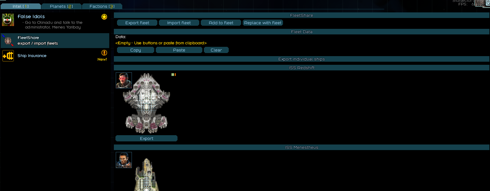

# Starsector Fleet Sharing Mod

## Description

This mod enables seamless fleet sharing between players in *Starsector*. Export your fleet into a shareable string, allowing another player to spawn it in their game. The shared fleet retains all details, including:

- Fleet composition
- Weapons
- Fighters
- Captains
- Cargo contents

Challenge friends to test their "overpowered low-tech fleet" against your high-tech masterpiece, even with modded weapons, hulls, and captain skills.

## Prerequisites

To use this mod, you need:

- **Console Commands** by LazyWizard: [Download here](https://fractalsoftworks.com/forum/index.php?topic=4106.0)
- **LazyLib** by LazyWizard: [Download here](https://fractalsoftworks.com/forum/index.php?topic=5444.0)

## How to Use

## Using the UI
This menu is accessible via the intel tab of the starsector campaign in the important category

Use the export button to get a string representing your fleet to share with others, or import someone else fleet from your clipboard!

## Using console commands
### Sharing Your Fleet
1. In-game, open the console with <kbd>Ctrl</kbd> + <kbd>Backspace</kbd>.
2. Type the `exportfleet` command.
3. The shareable string is automatically copied to your clipboard.


### Importing a Fleet
1. In-game, open the console with <kbd>Ctrl</kbd> + <kbd>Backspace</kbd>.
2. Enter the command `importfleet SharedStringHere`, replacing `SharedStringHere` with the shared string.
3. The fleet will spawn in your game.


### Adding to your Fleet
1. In-game, open the console with <kbd>Ctrl</kbd> + <kbd>Backspace</kbd>.
2. Enter the command `addtomyfleet SharedStringHere`, replacing `SharedStringHere` with the shared string.
3. The fleet will be added to yours.

### Replacing your fleet
1. In-game, open the console with <kbd>Ctrl</kbd> + <kbd>Backspace</kbd>.
2. Enter the command `replacemyfleet SharedStringHere`, replacing `SharedStringHere` with the shared string.
3. Your fleet will be replaced with the one from the string.

### FAQ
- **Can this mod be added or removed mid-game?**  
  No, it cannot be removed once added.
- **What about mod compatibility?**  
  The mod is compatible with all mods, but you must have the same mods installed as the player who shared the fleet.

<details>
<summary>My fleet (vanilla)</summary>

```
7F1bd9s2Ev4rOtqHfbFbXnXxm+s4aXYd1yfObtvT5PBAJESiBgkWJGUrOf3vOwBFWbyDtNKzTt2HVqZmBhA4+OaCGfTLlDIXpYRFv07PjNnC+m6xtOe2vrRN3bBPpiHb4Fc4SUkkiX6Znp3CF9Z3prWcaUtzXicp5Mw1w1wa9nwh5ZDkhqIt5q8pxun0LOUZPtkPvZdqa7ZuzIqx0YpQkhKcTM9++7L7a3vupmSDp2drRBNc0GzfetOzqc8cD/G76ePT6IYzn+Mk2dH/eaIiJ8FRwrizyniSPlkYDjH3ceRuhbxomLh8lUpTy5IUkQh7HdIEl+IPddEGRz5+8o8kUYq5R1zxMp04g++fLNIjSSqYHBdR2iXtE3znuphiLnVJaJ8GSokefoAVusIbTKdnunkyTQIS55q0ptnDBYqRS1LG4ZGln0xdFq5Q+h4jD1ZXCNdgI8xmhrG07flyqWvG4mQaZJS+Y56QMk0YRdwBoZgCiy9mGHkcecgJBYWQGGCOOXwS48mfQ1YZjAhPVhQlqeMxMTzMlSSJmL57J/5KEegLbCY/i4hQP45JtGbcxZ4YfifOZYRO4Ze7KBb6MD37Mk3uCKX5D5Qf5SrC1yTNPOzkvw+45Xe7ZdHEq2ggprAMmIsFU2RIsRtEjDJ/q8hAIg80mfeQ4wj2zta5xygGvQphzXCNRS+z5KvnoAjRbUKSCrFRJk62IDFMHPwQY54SqbUd5PkaOhjmzlHk9lCTEDQsdUJAMD/XzE7ytVAkoTsZVaCOhfaRz4ADiIdSpcprAqqxJgBf1yiE7TU9Jx4SEoXa7R7dEsw5mpx/zoROAULBG4fH786vLuHvmAH0waQEWl+wMETyaxCQDzAHClAQBqu8x5IUlEa+nJiTVIzgcxQHxE2+jxlPOSLp4ydL+y6WewbW8Q5IIzYRnyag5xPiTX6r/r2fwqdP02LofB0cw9S0qbAv5+SCcbzHGHjyjqXBCtADe3uEyVXpDWfZDgsSylK5n3++nWhSkvygi82VbmPxO67eXv/78pXY4LB7YVXxI8SWuHVzx60bB9znVx8u31+ff3h7/aYkYg+F5RksihksC2Fa91Ra5MwKOfPig1F8MEf8Ns0quO0xK1NMQreLD8X8dGuMPJXXAxRRrupvb28n77EHeLZOd/j5XxwJcbYm9kmaYu9nAFwh/1Px4E0W5RoCOCxVLcBos0Wu0HCYi3y0e2Nifn1UyxJVilzYinJHlclmJbKQRDCtRkpY0kNK2GsbsGbRCqOwJnSuNENLeWi7RIk47DEsPaWyQFtZYPlXB4jHjEUx82qEpvqPNtRJy1Ipj73maZZXKCC0JkkrUawpuqsJ0XuF6KqrYai8V8APsRVI8poi/1aY9J1bKb0JsLEP2N15JcmPB/5N2UWpujCfxMhVP0pv9qOW9lI4UOZ8YdkzXZ+V/SgPg9+IYMM5e8cHnBXYxd+8d9PtquiDfA99mO9RcxBu3QCt16jsIvwIo3Hy0O4esPWauId+gflEv8C0h/kFVwRnKY5QlNYdA123F7OjeQZjzN7ehj9azwMjvPc01Ox8g017B/5xkgY4K3bozqqZNas2XXGGvOSecc+5z6OV/iftprADyyuGrovSUjJLylakgvhdlKYyZRmLCS9i2z6I3SnVDmMhEMy34AHANiKoYY1A0ICIcFjmLCSIZHyDtwJG8R8ZiUPQCXjaCrNN4WmSymj7s/SZICzBodAD8Q3yNgJ9Ks//5lBdic1gA0VikXZh5V+L60NiypoVuMGcBJjmlIeGQAaPeyPw+lItSrSfaA2cEHMX0J1vNeOY8aJxNKuwGGcVRjCNsj/zMUyzUfFmp4UbatguSQSKQqJ/JpNXOJTa2Gne2i2VxOtmaC/HbTGhWT0yWKrAfyVoa43tymFYS5BRt4ppgvFdA6GtJM5QojKVqPQeMwdbxcdYxc61RAoLTdo5zdAWxsKw5mU7V02MirQpodgRqkSZMBTfpCGqYHQZmQ9h+fz6135M1p+Kyb5IyhLXAZpt4kLk343Mj0hc8881Gy2PiMQnSpjXAl9GE1gNS93pPXm1lpFHWYN9dm+UWdhj9UHCcnQQ8gGc26RQspEoHYBqQqS56UVpwuVmLxylTqxup5zVA48IY48eCbO7hi6DNiV+kCK/J83FQfOPhOwtovSKqOLksyvd1EbVFwth5FMlG2HMR9iIAWHOi614XrYCvdiKv95WjLUMF2AEMEuL4+oxNqELliu+ewDQ15jZX6pl9sdbhHaRdl1kCPsC1Y8VyhCNUs5gX/bAfRuVWr7KOEpWSx3JtUYkny9Mw7YWmmEYc4Bzs4zk8qXKBIbMXlEJ62I0tMbploGvwImHxQqA5qRoRQUs/o7dPIOFsgdCCeLbNOCZKBsoUqSycELksQSYbgSyE4D9IbZgMLwPMh6qtgCizBSWhDrgN4nJdhIHmIYJQOuASauamHcs8tC2bGj+BZxEOj+DU0ZPNTnWsmxiDocoWZSV61r2YjU7nRmGfWq5s8XpYr6ena7WmrfGnmnbxupoBqfI8Sufwe8rm3Zw+uEDONroDnFUBtQBeIpCeaLX60i205mKdH1pggDxFUwX144cFTdyI8Y0O4tzfWZry5mlGfpsYcytzsQ5dkP5b/kfmKSHRZ1dkq12ZUJdsPLiWD5fx/J4+9wc7RA2O5X9ftZrlE6uWHT6KrvDldoWfQA4tLsxZXBI7hEPv1r+kIVY7ZRshDvhkg0oiyeMEn6IhTJ4jgshInMCRr18b/virAzDtveF0Jd9/Mz2sTt6Hx/ELQGKwHdhA81sp1qvsjU8YF/NUz5UbVGQQWS1ufCQAySLO180+5lrtncEzb7CkzcwpFeJyJ+k2RCj4VStsuGJis1xjAh3fNid8t2/qPQzV2l8BJV+haLsmEDtcuKr6LLeosyWaUBMaWna3JiZ+qJVmWvK2wzcLyr9vFR6fQSVFidqP9AMN9SqL5+k2x7P06N9um226HbeC2XqS3tuWNayEkjvguVqtVj1xF4MtuIY3eGGvqcQ+ejzC5Y/P8VfHa//pueAo/Uw5aSore86zx4YkY+rgxpVETaqTuugI+dIpVciy6hr8M/kShxMbzHilcpi+ytUXiWIoly5GnocKic4CVqxtImsfIDTMXb5+Ea9PLnluLtyzNN8vq5X0yPNosbWL7cMqqsQKZ3pa0qi+o6LUMaZzF/32iDLbD75t5bin5llmHNDN/WyDRJaHYqTfxghWBGBZZnvyz9liyT2cuwRGt1TJXBgokiUiNrZwlWbNlVLi5Hz+OSbt2Lji6JBecDibB0SxhQJLOmk9gARfLEsEO4x2k3bcbj1f9W/W23JpRA9Ty5yrRvlCyBpcPM3J4QVKtzeo8uxe0fFblL0EhAxVgMLr3ONb+zGmemLkqOQm7UxfsJjP2mPkW60nEZhOY3xBRz7ttq989HQ0WOMKbgYU+OhFxUthkqVRo17UAtSbTX3Y+87lvdNvj29vdVTzltwSRGd/MN4bS4ufsjf8shmXQ9vYEuhXTtLyU4t64UZDvJ+z6RJaKAvewxt3a7GQoms4n90TFNNnrFUItMbqlE6f3TFn2oqjjcstaFNtYVRI6v04Cp02LYOqEZW8ZDaX5ihKSyZ3j/7PjcKPBiKMnDPnfBOr3hTXY5NxQkaktjqLrk8SGzVvaX6kf636BZ9y8G9frTg/qgtQhcsCVnudQ7JkVVqr8Na7XUl7GujMpSoTCWqvmNxF3Q0SWST719batdUj9OT0jsosXspi3neG/94XZIjy98aMl5fqXGyDC1v7nFUbTkcUmeX8HohslVPY/Wkkly+ZWoVe7DJxP1r8NIb3JKvX7VXRYQGk9/oazQneY530PCCPc8Xe8yjYc+YkFbrCdxb4GnMnWGHvSjVu0JG1AhfEy9gvl8BryH90i2le5WGixaqMd1yrSl9tdR0JbXe2glSic7aDwj6cHCd5Xux9yB1TPtamyeGHxz51a5doR/wao7Z3+sWyW8ZG60jYqNa+KV6VWH90sHm1OLAVOvB+ebTmp2HnoX+giPGxUutdF0MSUTuGrWcRBzm1fuBK5cH5ne91aiWSlSNt+j1YHRH53XD9UzNDWyNrW4oa2qea7ixrq3PrgLssH9D1IPqLT+5khBstxGNF+/VpPUl6D4T3894jpJdfrLSlXotpe6dTrKHE+JHAqtjzkKS4CaD0eZJFxc8McBYV6YcWu6CejEbz8ts2EczG8Mc1OO4yfvMwbA25BvG7irg3XA53j1K4r4r79RuTW26zlPplk5twM2mmgoy9t7VE2UrUk8pSp4PoFYJaACo0k9R9a7+qWiq5JssmdwCpkxuZW+cWGIkb38v5rSVO4HIfbcwVu5cw6fztbU8tdw1Pl1ZpnfqerZuLtbWAlvCg5DdOHLN/8hEE0a6FS/LtCUChswr9pDL8f10rwPvL29/+s/7i8tbuSiPnPpSt6qcSRbHlORw2M29XCyqzPmZWYjcgET5LeR9M5jbtbmvM0wVOC2tyhgivqsU7uE1bL3KyxHHTohTRFX4a0NvmChooCqD60ZtcMZ9FOWWpG9kszb0msm4sI+xNmh+BaLjoRQ5er+AeRe/0c9fe82H/GY/v9nFbyksQBe/3cafo3y+pbYuZfK87uBd7tl+vjy/+em6xlQ6Ch3AF6AwFFfPu3fD+MLfGY3IwMH26DiAJwFaGSIP4Dk4Pi69126u3QHwAI5H8zGE6dDJH8CXBBx73lCuvHDxMc1c0lOFXydPyAYs/Sajrryf8oBn1sckz+I8eM/V0SwlziqX2nj78OmAU+vVrCgi4FbU9pnaRJE/7A2Uq04HMD4m+waoymHb8RAEObwUccjG3ncv9zGVvk9i7BJEXwGaAtmXj+CppB+nZx9FaBR5EEd9nJ58lB6nfPqaPUDMn8qHxJOP1sWjPx/B+Pbm8uLt+dV0L19O8Z7xMGDiUsPIDeCN1ybTyc34ioCZd9ZZIv5HPBSFcd1UdEpwGedZLApIIhQxiCx8PHAOENiI/xUUbhXQN4WYQPCMHYiB79Dg0a9u2hnL7zENMuHgFpdfd0pdi60EtKvqci6rltcH47YvxBxqtlfgo43lLVWA1pk//fk/AAAA//8DAA==
```
</details>


## License

This software is free and unencumbered, released with the following conditions:

Anyone may copy, modify, publish, use, or distribute this software, in source code or compiled binary form, for any purpose, including commercial use, subject to these restrictions:

- You may not sell this software as-is.
- You may not misrepresent the origin of this software or claim authorship or exclusive rights to the original work.
- Attribution is appreciated but not required.

To the extent permitted by law, the author(s) dedicate all copyright interest in the software to the public domain, subject to the above restrictions.

**Disclaimer**: The software is provided "as is," without any warranty, express or implied, including but not limited to merchantability, fitness for a particular purpose, or non-infringement. The authors are not liable for any claims, damages, or liabilities arising from the use of or dealings with the software.


## Credits

**Author**: MatlabMaster

This mod was made possible thanks to community resources, including the *Starsector* wiki, open-source mods, and the official Starfarer API.
